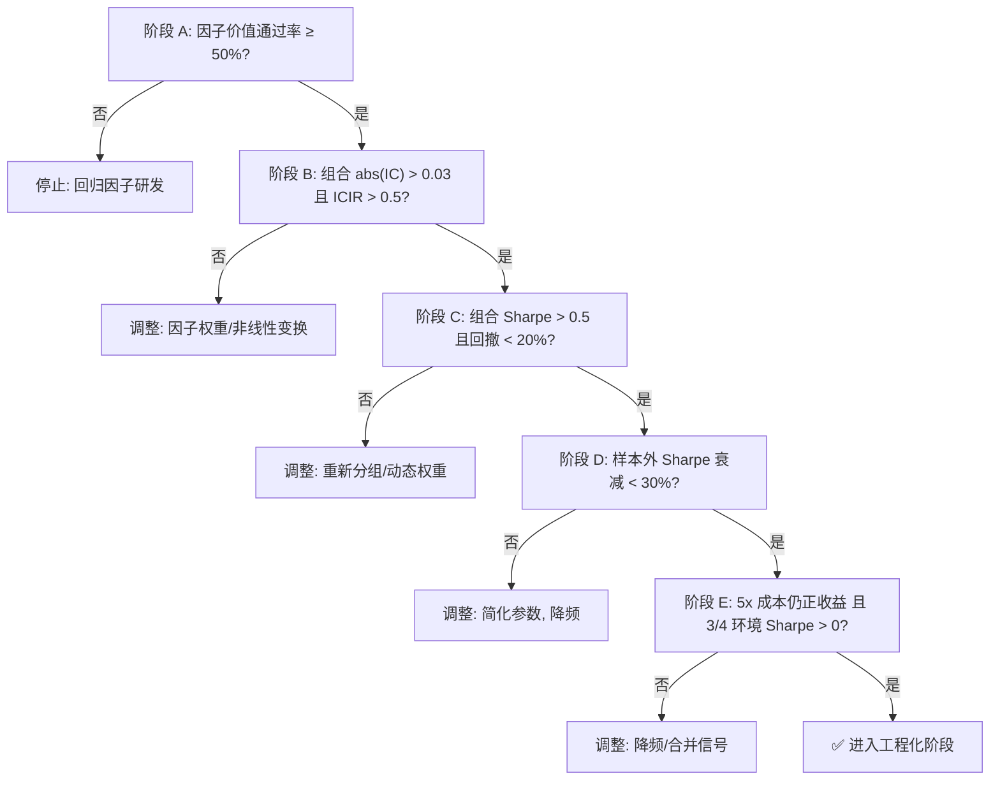

# 规则28：策略价值验证 — 5阶段硬性验证

**核心原则**：在投入工程化（滑点模型、实时风控、模拟盘）之前，必须通过 5 阶段硬性验证，确认当前因子/策略体系具有可交易价值。任何阶段未达阈值即停，回到因子/策略研发。

## 1. 验证阶段总览

| 阶段 | 目标 | 入口命令 | 阈值标准 |
|:---:|---|---|---|
| **A 因子价值** | 24 因子 alpha 是否真实 | `run_validate.py --method factor_alpha24/factor_ic/factor_review` | 通过率 ≥ 50%，组合 abs(IC) > 0.04 |
| **B 组合 IC** | 多因子加权后是否仍正 | `run_validate.py --method factor_combo_ic` | 组合 abs(IC) > 0.03 且 ICIR > 0.5 |
| **C 策略回测** | 多品种多策略端到端收益 | `run_backtest.py --experiment e1/e2/e3/--cross-sectional` | 组合 Sharpe > 0.5，回撤 < 20% |
| **D 稳健性** | 防止过拟合 | `run_backtest.py --experiment e6/e7/e8/e9` | 样本外 Sharpe 衰减 < 30% |
| **E 抗噪** | 成本与环境敏感度 | `--config config.cost_5x.yaml` + `market_regime_slice` | 5x 成本仍正收益，3/4 环境 Sharpe > 0 且无脆断 |

## 2. 阶段 A — 因子价值验证

### 2.1 24 因子逐个 IC/IR 筛选

```bash
python run_validate.py --method factor_alpha24
```

**通过标准（规则 9）**：
- 通过率 ≥ 50%（12/24 个因子）
- 每个通过因子：abs(IC 均值) > 0.03（支持反向因子，须确认 ICIR > 0.5）且 IR > 0.5
- 通过因子集合平均 abs(IC) > 0.04
- 最大互相关 < 0.6

### 2.2 滚动 IC 时序稳定性

```bash
python run_validate.py --method factor_ic
```

**通过标准**：
- 滚动 60 天 IC 方差 < 0.05
- 任何通过因子无大段年份变号

### 2.3 6 项因子复核

```bash
python run_validate.py --method factor_review
```

**6 项必查（规则 9 复核清单）**：
1. 数据存活率 ≥ 85%
2. 缺失值占比 ≤ 15%
3. 异常值抵抗：Winsorize 前后 IC 不翻转
4. **因子计算参数敏感性**：回看周期（如 `lookback`/`window`/`half_life`）±20% 扰动后，IC 衰减 < 30%
5. 因子正交性：与 Barra 风格因子相关性 ≤ 0.5
6. 时序稳定性：1 年期 ICIR 方差可控

> **注**：本项专测**因子计算参数**（如 `lookback`/`window`/`half_life`），交易执行参数的敏感性在 D 阶段（5.3）执行。

**A 阶段产物**：
- `output/validate/factor_alpha24_screening.csv` — 24 因子 Pass 标记
- `output/validate/factor_ic_stability/` — 滚动 IC 时序图
- `output/validate/factor_review_report.csv` — 6 项检查明细

## 3. 阶段 B — 多因子组合 IC

**目标**：等权/IC 加权合成后是否仍保持正 alpha。

**新增模块**：`runner/validation/factor_combo_ic.py`
- 委托 `core/factors/alpha_futures/factor_engine.py` 计算各因子值并合成组合
- 委托 `core/engine/rolling_ic.py` 计算组合的滚动 IC 与 ICIR
- 具体原子操作（Z 分数、ATR/ADX 等）由各模块内部封装，验证规则不绑定到底层函数

**接口**（与 `_VALIDATOR_MAP` 一致）：
```python
def factor_combo_ic_validation(data_source, config, lib, output_dir, **kwargs) -> Dict[str, Any]
```

**注册到映射表**（`runner/validation/__init__.py`）：
```python
from runner.validation.factor_combo_ic import factor_combo_ic_validation
_VALIDATOR_MAP["factor_combo_ic"] = factor_combo_ic_validation
```

**通过标准**：
- 等权组合 abs(IC 均值) > 0.03（支持反向因子）
- 等权组合 ICIR > 0.5
- 至少 60% 品种上为正

## 4. 阶段 C — 策略回测验证

### 4.1 E1 单策略多品种基线

```bash
python run_backtest.py --experiment e1
```

**通过标准**：
- 至少 70% 品种的 Sharpe > 0
- 各策略×品种矩阵平均 Sharpe > 0.3

### 4.2 E2/E3 多策略组合

```bash
python run_backtest.py --experiment e2   # 等权组合
python run_backtest.py --experiment e3   # 动态权（rolling IC 加权）
```

**通过标准**：
- 组合 Sharpe > 0.5
- 最大回撤 < 20%
- 胜率 > 45%

### 4.3 横截面多策略

```bash
python run_backtest.py --cross-sectional
```

**通过标准**：
- 组合 Sharpe > 0.5
- 年化收益 > 8%
- 与单品种策略相关性 < 0.5

## 5. 阶段 D — 稳健性验证（防过拟合）

### 5.1 Walk-Forward（E6）

```bash
python run_backtest.py --experiment e6
```

- 训练 252 bars，测试 63 bars，步进 21 bars（`config.yaml:walk_forward`）
- **通过标准**：测试期 Sharpe 均值 > 0.3，且较训练期衰减 < 30%

### 5.2 样本外验证（E7）

```bash
python run_backtest.py --experiment e7
```

- 样本内截止 `in_sample_end_date: '2024-05-31'`
- **样本外 2024-06-01 至 2026-05-31**（24 个完整月，每月随 full_end_date 滚动更新）
- **通过标准**：样本外 Sharpe > 0，最大回撤不超过样本内 1.5 倍

### 5.3 交易执行参数敏感性

```bash
python run_optimize.py --method sensitivity
```

- **测试范围**：交易执行参数（`rebalance_freq`/`stop_loss_pct`/`entry_threshold`/`position_cap`）
- **通过标准**：上述参数 ±20% 扰动后，组合 Sharpe 变化 < 30%

> **注**：本项专测**交易执行参数**（如 `rebalance_freq`/`stop_loss_pct`），因子计算参数的敏感性在 A 阶段（2.3.4）执行，避免重复测试。

### 5.4 Bootstrap / Monte Carlo（E8/E9）

```bash
python run_backtest.py --experiment e8   # Bootstrap，5000 次
python run_backtest.py --experiment e9   # Monte Carlo，1000 次
```

- **通过标准**：Sharpe 95% 置信区间不含 0

## 6. 阶段 E — 成本与环境抗噪

### 6.1 交易成本敏感度

**核心**：在独立配置文件中提高 `commission`/`slippage`，避免污染基础 `config.yaml`：

**强制要求**：
- **必须使用独立配置文件**，如 `config.cost_2x.yaml`、`config.cost_5x.yaml`、`config.cost_10x.yaml`
- **必须支持命令行覆盖**，如：

  ```bash
  python run_backtest.py --config config.cost_5x.yaml
  # 或：
  python run_backtest.py --override backtest.commission=0.0005 --override backtest.slippage=0.0005
  ```

- **禁止**直接修改原始 `config.yaml`，运行结束后无需手动还原（配置文件隔离即天然防污染）
- 入口脚本（`run_backtest.py`/`run_optimize.py`/`run_validate.py`）必须实现上述 `--config` 与 `--override` 参数解析

**通过标准**：
- 5x 成本下组合仍为正收益
- Sharpe 衰减 < 50%

### 6.2 市场环境切片

**核心**：因 `regime_filter_enabled` 已被规则 1+规则 3 删除，使用 **ATR 滚动分位数 + ADX 趋势强度** 替代识别。

**新增模块**：`runner/validation/market_regime_slice.py`

**切片参数（硬编码常量，禁止优化）**：
> 这些参数为**辅助识别参数**，不得进入 `config.yaml` 或被优化器扫描，避免引入新的过拟合维度。

| 参数 | 硬编码值 | 含义 |
|---|---|---|
| `ADX_WINDOW` | 20 | ADX 回看周期 |
| `TREND_THRESHOLD` | 25 | ADX 趋势/震荡分界 |
| `SMA_WINDOW` | 60 | 中长期均线回看周期 |
| `TREND_DEV_PCT` | 0.05 | 趋势市偏离阈值 |
| `RANGE_DEV_PCT` | 0.02 | 震荡市偏离阈值 |
| `VOL_HIGH_QUANTILE` | 0.80 | 高波动分位 |
| `VOL_LOW_QUANTILE` | 0.20 | 低波动分位 |

**切片规则**（基于 `utils/indicators.py`）：
- **趋势市**：`ADX(20) > 25` AND `|close/SMA(60) - 1| > 5%`
- **震荡市**：`ADX(20) < 25` AND `|close/SMA(60) - 1| < 2%`
- **高波动**：`ATR(20) / close` 处于历史 80 分位以上
- **低波动**：`ATR(20) / close` 处于历史 20 分位以下

**通过标准（提升要求）**：
- 至少在 **3 种**环境下 Sharpe > 0
- 且**任意单一环境下 Sharpe > -1.0**（禁止脆断），防止策略在某种环境（如趋势反转期）下发生极端亏损

## 7. 决策树（Go / No-Go）



## 8. 验证产物汇总

| 阶段 | 产物路径 | 内容 |
|---|---|---|
| A1 | `output/validate/factor_alpha24_screening.csv` | 24 因子 IC/IR/Pass 标记 |
| A2 | `output/validate/factor_ic_stability/*.csv` | 滚动 IC 时序 |
| A3 | `output/validate/factor_review_report.csv` | 6 项检查明细 |
| B | `output/validate/factor_combo_ic.csv` | 组合 IC / ICIR / 品种覆盖 |
| C1 | `output/backtest/e1_baseline_metrics.csv` | 单策略×多品种 Sharpe 矩阵 |
| C2 | `output/backtest/e2_e3_*.csv` | 多策略组合净值 |
| C3 | `output/backtest/cross_sectional_*` | 横截面组合净值 |
| D1 | `output/backtest/e6_walkforward_metrics.csv` | 滚动窗口 Sharpe |
| D2 | `output/backtest/e7_out_of_sample_metrics.csv` | 样本内/外对比 |
| D3 | `output/optimize/sensitivity_*.csv` | 参数扰动 Sharpe 变化 |
| D4 | `output/backtest/e8_bootstrap_*.csv` / `e9_monte_carlo_*.csv` | 置信区间 |
| E1 | `output/backtest/cost_5x_*.csv` | 5x 成本下净值 |
| E2 | `output/validate/regime_slice_*.csv` | 各环境下 Sharpe |

## 9. 验证失败时的行动

**不要继续优化回测系统**：再精良的引擎也无法让负期望策略盈利。

**回到因子研究**：
- 使用 `core/factors/alpha_futures/factor_pipeline.py::FactorPipeline` 对现有因子做非线性变换
- 尝试新数据源（订单流、期限结构精细化）
- 引入机器学习模型（滚动回归、XGBoost）合成因子

**重新设计子策略**：
- 基于有效因子重新分组（而非固定 5 类）
- 使用 `core/portfolio.py::PortfolioManager` 动态分配因子权重

## 10. 涉及代码

- **因子筛选**：`runner/validation/factor_alpha24.py`、`factor_stability.py`、`factor_review.py`
- **组合 IC（新增）**：`runner/validation/factor_combo_ic.py`
- **市场环境切片（新增）**：`runner/validation/market_regime_slice.py`
- **实验**：`runner/backtest/experiments/e1_e5.py`、`e6_e11.py`
- **优化**：`runner/optimization/grid_search.py`、`window_search.py`、`sensitivity.py`、`oos_selector.py`
- **公共指标**：`utils/indicators.py`、`utils/metrics.py`
- **核心因子**：`core/factors/alpha_futures/factor_engine.py`、`factor_registry.py`
- **配置**：
  - 基础配置：`config.yaml`（`backtest.commission/slippage`、`walk_forward`、`bootstrap`、`monte_carlo`）
  - 成本敏感度独立配置：`config.cost_2x.yaml`、`config.cost_5x.yaml`、`config.cost_10x.yaml`（不得修改基础 `config.yaml`）
  - 命令行覆盖：通过 `--config` / `--override key=value` 注入

## 11. 与其他规则的关系

- 规则 1 / 26：双引擎交叉验证在 D 阶段执行
- 规则 9：阶段 A 的 6 项复核清单
- 规则 15：本规则是规则 15 在策略价值层面的扩展（5 阶段硬性验证）
- 规则 22：阶段 D 的滚动窗口基准

---

*本规则对应需求：策略价值验证的端到端流程标准化，所有阶段未通过前禁止进入工程化阶段。*
