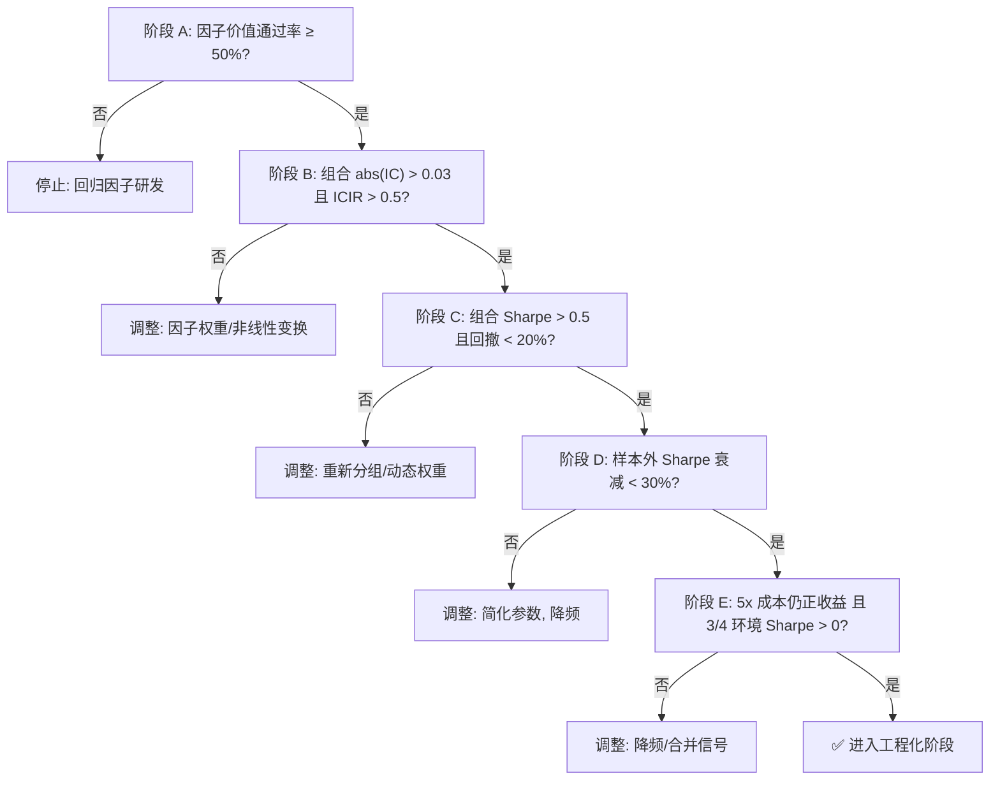

# 量化回测系统开发规范

---

> **注意**：本文件由 `merge-rules.py` 自动生成，请勿直接编辑。
> 如需修改规则，请编辑对应分类目录下的规则文件，然后重新运行合并脚本。

---

# 规则1：引擎回退禁止，必须并行验证

**核心原则**：自研回测引擎不做 PyBroker 的回退方案，两套引擎并行运行用于交叉验证。

**具体规则**：
- PyBroker 执行失败必须直接抛出异常，不允许静默回退到自研引擎
- 自研引擎（runner.py）与 PyBroker 引擎同时运行，结果对比作为验证
- 并行运行后对比核心指标（Sharpe、最大回撤、年化收益），差异超 10% 发出警告
- 自研引擎仅用于交叉验证和边缘场景测试，不做主回测引擎

**涉及代码**：
- `core/engine/backtest_runner.py:run()`：PyBroker 不可用时直接抛 RuntimeError，不回退
- `core/engine/runner.py`：`BacktestRunner.cross_validate_with_pybroker()` 方法实现并行验证
- `core/config/backtest_config.py`：`cross_validate` 开关控制是否执行交叉验证


---

# 规则2：配置管理 — config.yaml 是单一数据源 + 分层配置 + OOS 截止与年化

**核心原则**：config.yaml 是一切配置的最终来源；按优先级 `defaults < YAML < env vars < runtime overrides` 分层叠加；OOS 截止日期固定为"上个月底 + 倒退 24 个月"；所有绩效指标必须年化。

**生效日期**：2026-06-11（吸收规则 23 + 规则 33）

---

## 2.1 yaml 与 BacktestConfig 同步

- 删除 config.yaml 中的废弃字段（fusion_mode、regime_filter_enabled、strategy_switching 等）
- BacktestConfig 字段命名与 config.yaml 保持一致
- 新增配置项先在 yaml 定义，再在 BacktestConfig 中映射
- 运行 `BacktestConfig.from_yaml()` 后做字段完整性校验

---

## 2.2 分层配置（吸收自规则 23）

**优先级（低 → 高）**：
```
1. dataclass 默认值     （代码内置）
2. YAML 文件            （config.yaml — 单一数据源）
3. 环境变量 QUANT_*     （部署/容器/CI 注入）
4. 运行时 overrides     （Pipeline / 脚本 / 测试）
```

**违反本规则的典型表现**：
- 在脚本顶部 `os.environ["X"] = ...` 然后再 `from core.config import ...` —— 散落难追踪
- 在多个 yaml 文件里维护同一字段（dev.yaml / prod.yaml）—— 重复且易错
- 测试用例里直接修改 yaml 文件 —— 污染用户配置

**正确做法**：一份 yaml + 一套环境变量约定 + 一份代码默认，三层自动合并。

### 规则 2.2.1：env 变量必须带 `QUANT_` 前缀

```bash
# ✅ 合规
export QUANT_BACKTEST__REBALANCE_FREQ=7
export QUANT_OUTPUT__OUTPUT_DIR=/tmp/run1

# ❌ 违规（无前缀会污染环境）
export BACKTEST_REBALANCE_FREQ=7
```

### 规则 2.2.2：env 变量名约定 `QUANT_<SECTION>__<FIELD>`

- `<SECTION>` 对应 yaml 顶层段名（小写）
- 双下划线 `__` 分隔段与字段
- `<FIELD>` 对应 yaml 字段名（小写）

| env 变量 | yaml 路径 |
|----------|----------|
| `QUANT_BACKTEST__REBALANCE_FREQ` | `backtest.rebalance_freq` |
| `QUANT_BACKTEST__STOP_LOSS_PCT` | `backtest.stop_loss_pct` |
| `QUANT_OUTPUT__OUTPUT_DIR` | `output.output_dir` |

### 规则 2.2.3：overrides dict 的 key 格式

- **顶层字段**（yaml 顶层键）：`"symbols"` / `"factor_weights"`
- **段路径**：`"backtest__rebalance_freq"`（推荐）
- **嵌套 dict**：`{"backtest": {"rebalance_freq": 7}}`（推荐用于覆盖多个字段）

**禁止**用 dataclass 字段名作为 override key：yaml 字段是 `rebalance_freq`，dataclass 字段是 `rebalance_days`，名字不一致时会静默失效。

### 规则 2.2.4：overrides 类型与 yaml 字段一致

- yaml 字段是 `int` → override 传 `int`（不要传 `"10"` 字符串）
- yaml 字段是 `bool` → override 传 `bool`
- env 变量全是字符串，由 `_coerce_env_value` 自动启发式转换
- runtime override 不做类型转换（保证精度），由调用方负责

### 规则 2.2.5：加载器接口必须保留向后兼容

`BacktestConfig.from_yaml(path)` 必须保持原有签名（不传 overrides 行为不变）：

```python
# 老代码：仍能跑
cfg = BacktestConfig.from_yaml("config.yaml")

# 新代码：可选 overrides
cfg = BacktestConfig.from_yaml("config.yaml", overrides={"backtest__rebalance_freq": 7})
```

**禁止**：把 `overrides` 改成必传位置参数，破坏调用方。

### 规则 2.2.6：环境变量只在加载时读取一次

`load_env_overrides()` 在 `from_yaml()` 内部调用一次，结果冻结到 BacktestConfig 实例。后续修改 `os.environ` 不影响已加载的实例（避免 race condition）。

### 规则 2.2.7：secret 不应进 yaml（用 `${VAR}` 占位符）

API key、密码、token 等敏感值：
- 在 config.yaml 中用 `${VAR_NAME}` 占位（如 `tqsdk_phone: ${TQSDK_PHONE}`）
- 实际值存 `.env` 文件（gitignored，不会泄露）
- 由 `yaml_utils.load_yaml()` 内 `load_dotenv()` + 正则替换自动展开
- **禁止**直接把明文密码写进 yaml

**历史教训**（2026-06-14）：原 `pybroker_data_source.py` 中手工读 config.yaml 拿到的 `${TQSDK_PHONE}` 是字面量，因为 YAML 本身不展开 `${VAR}`。必须在 `load_yaml()` 内先 `load_dotenv()`，再做正则替换。仅靠调用方侧 `load_dotenv()` 不可靠（模块导入顺序影响）。

---

## 2.3 OOS 截止日期（吸收自规则 33）

### 核心公式

```
full_end_date         = 当前时间上个月底
out_sample_start_date = full_end_date 倒退 24 个月 + 1 天
in_sample_end_date    = out_sample_start_date - 1 天
```

**OOS = 24 个完整月**（不可缩短、不可延长；缩短会导致样本不足，延长会引入未来数据风险）。

### 当前值（2026-06-18）

```yaml
backtest:
  full_start_date: '2020-01-01'          # 固定
  full_end_date: '2026-05-31'            # 上个月底
  in_sample_end_date: '2024-05-31'       # OOS 起点 - 1 天
  out_sample_start_date: '2024-06-01'    # 倒退 24 个月
```

### 定期更新

每月 1 日执行 `./scripts/update_oos_dates.sh`：

| 当前月 | full_end_date | OOS 区间 |
|--------|--------------|----------|
| 2026-06 | 2026-05-31 | 2024-06-01 ~ 2026-05-31 |
| 2026-07 | 2026-06-30 | 2024-07-01 ~ 2026-06-30 |
| 2026-08 | 2026-07-31 | 2024-08-01 ~ 2026-07-31 |

### OOS 验证标准

| 指标 | 标准 |
|------|------|
| OOS 夏普 | > 0（正收益） |
| OOS 回撤 | ≤ 样本内 1.5 倍 |
| OOS vs 样本内夏普衰减 | < 30% |

---

## 2.4 绩效指标年化折算（吸收自规则 33）

所有回测报告中的收益类指标**必须**按年化展示，禁止裸展示合计收益。

| 指标 | 公式 | 备注 |
|------|------|------|
| **年化收益率** | `(1 + total_return)^(1 / n_years) - 1` | `n_years = (end - start).days / 365.25` |
| **夏普比** | PyBroker 已年化，直接使用 | 无需额外计算 |
| **卡玛比** | `年化收益率 / 最大回撤` | |
| **最大回撤** | 绝对值展示，不需要年化 | |

### 代码实现

```python
from datetime import datetime

def _get_years(raw_config):
    bt = raw_config["backtest"]
    start = datetime.strptime(bt["full_start_date"], "%Y-%m-%d")
    end = datetime.strptime(bt["full_end_date"], "%Y-%m-%d")
    return (end - start).days / 365.25

def annualize(total_return_pct, years):
    return (1 + total_return_pct / 100) ** (1.0 / years) - 1
```

---

## 涉及代码

| 文件 | 职责 |
|------|------|
| `core/config/layered_config.py` | `LayeredConfigLoader` / `load_env_overrides` / `merge_overrides` |
| `core/config/backtest_config.py` | `BacktestConfig.from_yaml(overrides=...)` 集成 |
| `core/config/__init__.py` | 公共 API 导出 |
| `config.yaml` | `full_end_date` / `in_sample_end_date` / `out_sample_start_date`，每月更新 |
| `scripts/update_oos_dates.sh` | 每月初自动更新 OOS 日期 |

---

## 维护检查清单

### 配置加载（2.2）
- [ ] `BacktestConfig.from_yaml()` 保留 `path` 必传 + `overrides` 可选
- [ ] 优先级顺序：defaults < yaml < env < runtime 保持不变
- [ ] 新增 env 变量前先在 `ENV_SECTION_ALIAS` 注册段名（若非标准）
- [ ] secret 不进 yaml（走 env / overrides）
- [ ] 测试覆盖：基础合并 / 嵌套合并 / 优先级 / 字段名兼容

### OOS 日期（2.3）
- [ ] `full_end_date` 每月 1 日已更新为"上个月底"
- [ ] `in_sample_end_date` / `out_sample_start_date` 与 `full_end_date` 同步计算
- [ ] OOS 区间 = 24 个完整月（不可缩短）
- [ ] OOS 验证结果符合标准（Sharpe>0 / MDD≤1.5x / 衰减<30%）

### 绩效展示（2.4）
- [ ] 所有收益类指标按年化展示
- [ ] 报告/日志中无裸合计收益
- [ ] 卡玛比计算使用年化收益

---

## 与其他规则的关系

| 关联规则 | 关系 |
|----------|------|
| 规则 17（不重复造轮子） | env/runtime override 必须走 `from_yaml(overrides=...)`，禁止重复实现 |
| 规则 18（Pipeline 编排器） | `pipe.with_config(overrides={...})` 实现本规则的运行时层 |


---

# 规则3：废弃代码必须彻底清理

**核心原则**：已废弃的模块、字段、兼容层一律删除，不留后患。

**具体规则**：
- 废弃模块直接删除，不做 `@deprecated` 兼容别名
- 废弃字段从 config.yaml 和代码中同步删除
- 每轮重构完成后，全量 grep 检查废弃引用
- 根目录兼容层（如 config.py）在确认无引用后立即删除


---

# 规则4：风控类统一 — 一个系统只有一个风控

**核心原则**：不允许两个风控类并存，新代码用 RiskController，旧代码迁移。

**具体规则**：
- 核心风控逻辑在 RiskController 中实现
- RiskManager 作为 PyBroker 适配层，委托给 RiskController
- 新功能只加在 RiskController，RiskManager 不再扩展


---

# 规则5：策略注册统一 — 多策略横截面打分

**核心原则**：彻底移除单策略绑定机制，所有策略通过横截面打分进行动态仓位分配，统一使用 `CrossSectionalStrategy` 管理多策略组合。

**具体规则**：
- 统一使用 `core/strategy_registry.py` 的 StrategyLibrary 管理策略档案
- 所有策略类必须实现 `compute_score` 方法，返回归一化到 [-1, 1] 的因子得分
- 不再使用单策略 `execute` 方法做多/空二元决策，改为因子得分输出
- 多策略组合通过 `CrossSectionalStrategy` 进行横截面标准化 + 排名叠加
- 策略发现、参数获取、性能档案全部走统一入口

**涉及代码**：
- `core/strategies/cross_sectional.py`：多策略横截面打分引擎
- `core/strategy_registry.py`：策略库与档案管理
- `core/strategies/strategy_*.py`：各策略的 `compute_score` 方法


---

# 规则6：测试覆盖 — 关键路径必须有测试

**核心原则**：因子计算、调仓决策、风控触发必须有自动化测试覆盖。

**具体规则**：
- 新增策略必须有对应的因子计算正确性测试
- 新增风控规则必须有触发条件测试
- 调仓逻辑修改必须有调仓日判断测试
- 修改核心逻辑前先补测试，再重构


---

# 规则7：文件行数限制

**核心原则**：单文件不超过 500 行，超过必须拆分。

**具体规则**：
- 超过 500 行的文件在下次修改时强制拆分
- 拆分原则：按职责单一，每个模块只做一件事
- 当前需拆分的文件：暂无（broker_adapter.py 已拆分）


---

# 规则8：命名必须与功能一致

**核心原则**：类名、函数名必须准确反映当前功能，不允许名不副实。

**具体规则**：
- 类名变更后同步更新所有引用和文档
- 策略名称与策略文件一一对应，不允许别名
- 变量名包含计量单位（如 `_days`、`_pct`、`_bars`）


---

# 规则9：因子开发规范 — 24因子体系，IC 驱动，先验证后集成

**核心原则**：因子必须通过 IC 检验才能进入策略组合，无效因子不入库。基于 24 个因子（5 大类：趋势 T_01~T_05、回归 R_01~R_05、波动率 V_01~V_04、资金流 M_01~M_05、高阶复合 H_01~H_05）构建因子体系。

**新增因子入口**：所有新因子（Alpha 或 CTA）必须通过 `UnifiedFactorPool` 统一入口计算，详情见 [规则32：统一因子池架构](../01-basics/32-factor-pool.md)。

**因子准入标准**：
- 新因子必须实现 `FactorEvaluator` 接口，输出 IC、IR、多周期稳定性
- IC > 0.03 且 IR > 0.5 的因子方可保留，否则标记为待优化
- 因子间相关性 > 0.7 视为冗余，保留 IC 更高的因子
- 因子变换（对数/指数/幂函数/交叉项）必须对比原始因子的 IC 变化
- 最终因子集平均 IC > 0.04，最大互相关 < 0.6

**因子复核清单（6 项必须通过）**：
1. **数据存活率**：因子有效值占比 ≥ 85%，缺失率 > 15% 说明适用面过窄，需剔除或降级
2. **缺失值占比**：每个因子缺失率 ≤ 15%，超过则标记为待优化
3. **异常值抵抗**：极值处理前后 IC 对比，若极值导致 IC 翻转，说明因子抗噪极差，需增加 Winsorize 截尾
4. **参数敏感性**：关键参数微调（如跳空修复权重 0.3/0.7），若 IC 大幅衰减，说明过拟合，不具稳健性
5. **因子正交性**：与传统 Barra 风格因子（动量、波动率）相关性 ≤ 0.5，正交化后 t 值 ≥ 1.96
6. **时序稳定性**：滚动 1 年期 ICIR 时间方差，若某段年份极好另一段极差（甚至变号），说明逻辑非普适

**涉及代码**：
- `core/factors/factor_evaluator.py`：因子评估框架
- `core/factors/factor_selector.py`：因子筛选与去冗余
- `core/factors/factor_transformer.py`：因子变换与交叉项
- `core/factors/factor_review.py`：因子复核模块（6项检查）


---

# 规则10：（已移除）自适应参数模块已删除，功能由子策略体系覆盖

本规则已移除，相关功能由规则 21 的子策略体系覆盖。


---

# 规则11：多时间框架（规划中）

**核心原则**：多时间框架的核心价值是过滤逆势交易，而非增加交易机会。

**具体规则**：
- 日频信号与周频趋势方向一致时才执行交易，不一致时跳过或减仓
- 周频权重 60%，日频权重 40%，不得随意调整
- 冲突场景占比应 < 40%，冲突时盈亏比 > 1.0
- 周频信号缓存，日频信号实时计算，周五对齐同步
- 过滤后交易次数减少 > 30% 且胜率提升 > 5% 方为有效

**涉及代码**（规划中，模块尚未实现）：
- `core/multi_tf/trend_filter.py`：周频/月频趋势判断
- `core/multi_tf/signal_filter.py`：时间框架过滤规则
- `core/multi_tf/signal_sync.py`：信号延迟处理与同步


---

# 规则12：（已移除）动态仓位模块已删除，功能由子策略体系覆盖

本规则已移除，相关功能由规则 21 的子策略体系覆盖。


---

# 规则13：止损策略 — 分层叠加，效果可量化

**核心原则**：止损优化应先验证追踪止损，再叠加时间止损，最后考虑复合止损。

**具体规则**：
- 追踪止损支持固定点数和 ATR 倍数两种模式
- 时间止损：持仓 N 个交易日（5~15 可配置）未达目标则强制平仓
- 复合止损优先级：价格止损 > 时间止损 > 波动率止损
- 波动率止损：ATR 突然放大 3 倍以上时触发紧急止损
- 止损效果必须量化：触发频率、平均盈亏、最大回撤改善、对 Sharpe 的影响

**涉及代码**：
- `core/risk/trailing_stop.py`：追踪止损
- `core/risk/time_stop.py`：时间止损
- `core/risk/composite_stop.py`：复合止损管理
- `core/risk/stop_analyzer.py`：止损效果分析


---

# 规则14：（已移除）品种选择模块已删除，功能由子策略体系覆盖

本规则已移除，相关功能由规则 21 的子策略体系覆盖。


---

# 规则15：回测验证 — 多阶段验证，鲁棒性优先

**核心原则**：所有新功能必须通过样本外验证，Sharpe 不得低于旧版本 90%。

**具体规则**：
- 多阶段回测：样本内（2018-2020）→ 样本外（2021-2022）→ 实时模拟（2023 至今）
- 样本外 Sharpe 衰减 < 30%，最大回撤不超过样本内的 1.5 倍
- 蒙特卡洛模拟 1000 次 Bootstrap，Sharpe 95% 置信区间不含 0
- 参数敏感性分析：关键参数 ±20% 扰动，Sharpe 变化 < 15%
- 灰度发布：新功能通过 config.yaml 开关控制，默认关闭
- 每个里程碑完成后打 git tag，出问题时回滚到上一个 tag

**涉及代码**：
- `core/validation/monte_carlo.py`：蒙特卡洛模拟
- `core/validation/sensitivity.py`：参数敏感性分析
- `config.yaml`：灰度开关配置


---

# 规则16：模块目录结构 — 职责单一，接口清晰

**核心原则**：每个模块目录只做一件事，模块间通过明确接口交互。

**目录结构**（当前实际状态，标注"规划中"的模块尚未实现）：
```
core/
├── config/            # 配置管理（BacktestConfig + 因子/止损/验证配置）
├── factors/           # 因子模块（24因子体系 + 评估 + 变换 + 筛选 + 复核 + 清洗）
│   └── alpha_futures/ # 新因子库（基于抽象基类的独立因子类 + 注册表 + 引擎调度）
├── multi_tf/          # 多时间框架模块（规划中）
├── risk/              # 止损优化模块（追踪+时间+复合止损）
├── validation/        # 回测验证模块（蒙特卡洛+敏感性）
├── engine/            # 回测引擎（PyBroker+自研+策略集成）
│   ├── backtest_runner.py    # PyBroker 主回测运行器
│   ├── runner.py             # 自研验证引擎
│   ├── switch_engine.py      # 因子打分引擎（5子策略信号动态加载）
│   ├── strategy_executor.py  # 策略执行器工厂
│   ├── strategy_indicators.py# 策略指标注册表 + 退出钩子注册表（解耦核心）
│   ├── sub_strategy_adapter.py# 子策略适配器（连接因子库与子策略体系）
│   ├── top_level_integrator.py# 顶层策略集成器（信号合并）
│   ├── rolling_ic.py         # 滚动IC动态权重引擎
│   ├── factor_decay.py       # 因子衰减监控器
│   └── pybroker_data_source.py# PyBroker 数据源封装
├── strategies/        # 策略实现（5子策略 + 基类 + 横截面打分）
│   └── sub_strategies/# 5子策略：趋势/期限结构/均值回归/波动率突破/复合共振
├── performance/       # 绩效评估
├── monitor/           # 策略监控（规划中）
└── ext/               # 可选扩展（规则21）：adapters/factors/models/handlers/utils
                        # 按需安装（extras_require），工厂注册模式

# 以下模块已移除，功能由子策略体系覆盖：
# ├── adaptive/        # 已移除（规则10）
# ├── position/        # 已移除（规则12）
# ├── instrument/      # 已移除（规则14）
# └── market_regime/   # 已移除（兼容性桩保留在 core/engine/runner.py 和 core/__init__.py）

runner/                # 编排层（仅调用 core/ 和 utils/）
├── common/            # 通用工具
├── data/              # 数据加载与预处理
├── strategy/          # 策略选择与权重
├── backtest/          # 回测执行与实验
├── optimization/      # 参数优化
├── validation/        # 验证流程
└── report/            # 报告生成
```

**具体规则**：
- 新增模块必须在上述目录结构中，不得在 core/ 根目录新建文件
- runner/ 是编排层，不实现核心逻辑，仅调用 core/ 和 utils/
- 模块间依赖方向：strategies → factors → engine，不得反向依赖
- 每个模块的 `__init__.py` 必须导出公共接口，隐藏内部实现
- 跨模块调用必须通过接口，不得直接访问其他模块的内部变量


---

# 规则17：不重复造轮子 — 优先调用公共系统 + 根目录脚本收敛

**核心原则**：runner/ 层仅做编排，核心逻辑必须委托给已有公共系统；根目录脚本（`run_*.py`）只允许 3 个官方入口，其他工作流必须通过 Pipeline 编排器调用 `runner/` 模块。

**生效日期**：2026-06-10（吸收规则 20）

---

## 17.1 公共系统清单（必须直接调用）

- **配置管理**：`core/config/` - 使用 `BacktestConfig.from_yaml()` 加载配置
- **数据提供者接口**：`core/data_provider.py` - 使用 `DataProvider` 抽象接口，实现数据源解耦
- **统一数据加载器**：`core/data_loader.py` - 使用 `DataLoader` 支持 TqSdk/CSV 数据源，主力合约识别，展期处理
- **PyBroker数据源封装**：`core/engine/pybroker_data_source.py` - 使用 `create_hybrid_data_source()`
- **因子计算引擎**：`core/factors/alpha_futures/factor_engine.py` - 使用 `FactorEngine` 统一调度因子计算
- **因子注册表**：`core/factors/alpha_futures/factor_registry.py` - 使用 `@register_factor` 装饰器注册因子类
- **因子基类**：`core/factors/alpha_futures/base_factor.py` - 继承 `BaseFactor` 实现自定义因子
- **数据清洗算子**：`core/factors/futures_data_cleaners.py` - 使用 `compute_open_adj()`/`compute_carry()`/`compute_oi_safe()` 等
- **基础算子库**：`core/factors/operators.py` - 使用 `delay()`/`delta()`/`sma()`/`std()`/`roll_ic()` 等通用函数
- **因子评估框架**：`core/factors/factor_evaluator.py` - 使用 `FactorEvaluator` 做 IC/IR/稳定性评估
- **策略指标注册表**：`core/engine/strategy_indicators.py` - 使用 `StrategyIndicatorRegistry` 注册策略指标
- **策略退出钩子注册表**：`core/engine/strategy_indicators.py` - 使用 `StrategyExitHookRegistry` 注册退出钩子
- **PyBroker回测引擎**：`core/engine/backtest_runner.py` - 使用 `PyBrokerBacktestRunner` 执行主回测
- **自研验证引擎**：`core/engine/runner.py` - 使用 `BacktestRunner` 执行验证，含 `cross_validate_with_pybroker()` 交叉验证
- **参数优化器**：`core/optimizer.py` - 使用 `ParameterOptimizer` 做网格搜索/滚动优化/Walk-Forward优化
- **多策略组合管理**：`core/portfolio.py` - 使用 `PortfolioManager` 管理多策略组合、权重分配
- **指标计算**：`utils/indicators.py` - 使用 `compute_true_range()`, `compute_adx()` 等
- **绩效指标**：`utils/metrics.py` - 使用 `MetricsCalculator`
- **报告生成**：`core/report_builder.py` - 使用 `generate_report()`
- **绘图**：`utils/plots.py` - 使用 `PlotManager`
- **策略注册**：`core/strategy_registry.py` - 使用 `StrategyLibrary`
- **统一因子池**：`core/execution/factor_pool.py` - 使用 `UnifiedFactorPool` 单入口计算所有信号（24 Alpha + 6 CTA）
- **信号抽象层**：`core/execution/signal_abstraction.py` - 使用 `SignalAbstractionLayer` 按模式提取信号（横截面/CTA/混合）

---

## 17.2 官方入口脚本（吸收自规则 20）

根目录脚本（`run_*.py`）**只允许 3 个官方入口**，其他工作流必须通过 Pipeline 编排器调用 `runner/` 模块。

| 脚本 | 委托方法 | 用途 |
|------|----------|------|
| `run_backtest.py` | `pipe.run_backtest()` / `pipe.optimize()` / `pipe.validate()` / `pipe.report()` | 单实验 / 优化 / 验证 / 报告 |
| `run_optimize.py` | `pipe.optimize()` | 仅参数优化 |
| `run_validate.py` | `pipe.validate()` | 仅验证 |

> 这 3 个入口已记录于 README.md 和 docs/strategy_validation_plan.md，共 50+ 处引用，不可删除。

### 规则 17.2.1：禁止新增自定义根目录脚本

任何非官方入口的 `run_*.py` 都不允许新增。统一在 `runner/` 下新增模块 + 在 Pipeline 注册方法。

### 规则 17.2.2：禁止在根目录脚本自实现核心逻辑

若必须修改 3 个官方入口，主体逻辑（数据加载、回测执行、验证、报告）必须委托 `runner/` 模块或 `core/` 模块，不得在 `run_*.py` 内直接调用 `PyBrokerBacktestRunner.run()` 等底层 API。

### 规则 17.2.3：删除自定义工作流脚本须同时迁移到 Pipeline

删除根目录工作流脚本时，必须同步完成：
1. 提取其核心逻辑到 `runner/` 下对应模块（`backtest/` / `validation/` / `optimization/` / `report/`）
2. 在 `Pipeline` 类中新增对应方法
3. 更新 README.md 和 docs/ 中所有引用
4. 在本规则"已删除脚本"表格中记录迁移版本号

### 规则 17.2.4：Pipeline 方法命名规范

- 单一实验 → `pipe.run_backtest(name: str)`
- 批量实验 → `pipe.run_experiments(names: List[str])`
- 多窗口 OOS → `pipe.multi_oos(...)`
- 全量验证 → `pipe.full_validation(...)`
- 参数优化 → `pipe.optimize(...)`
- 验证方法 → `pipe.validate(method: str)`
- 报告生成 → `pipe.report(fmt: str)`

方法名使用动词或动名词短语，不使用缩写（除 `mc` / `oos` 等通用术语外）。

### 规则 17.2.5：模块导出与 hidden internal

- 每个新模块必须通过 `__all__` 显式导出公共接口
- 内部辅助函数使用下划线前缀（如 `_phase1_optimize` / `_phase2_ew_backtest`）
- Pipeline 内部入口方法（`run_*` / `multi_*` / `full_*`）必须为 `self` 返回类型（链式调用）

### 已删除脚本（迁移历史）

| 已删除 | 原行数 | 替换入口 | 迁移版本 |
|--------|--------|----------|----------|
| `run_full_experiments.py` | 78 | `pipe.run_experiments(experiments: List[str])` | a42e5fa (2026-06-10) |
| `run_full_validation.py` | 314 | `pipe.full_validation(in_sample_start, in_sample_end, oos_start, oos_end, ...)` | a42e5fa (2026-06-10) |
| `run_multi_oos.py` | 123 | `pipe.multi_oos(windows, strategies, best_params, ...)` | a42e5fa (2026-06-10) |

---

## 17.3 具体规则

- 禁止在 run_ 脚本或 runner/ 模块中重复实现已有功能
- 所有工具函数优先检查 `utils/` 和 `core/` 中是否已存在
- 公共函数提取统一到 `runner/common/utils.py`
- 发现重复实现必须先提取再使用
- 回测、优化、验证任务必须使用官方入口脚本，禁止重写回测脚本

---

## 17.4 维护检查清单

新增/删除/修改根目录脚本或 Pipeline 方法时，必须确认：

- [ ] 根目录仅有 `run_backtest.py` / `run_optimize.py` / `run_validate.py` 3 个
- [ ] 新方法/新模块已在 17.2.5 命名规范中登记
- [ ] `runner/` 下模块文件不超过 500 行（规则 7）
- [ ] `__all__` 显式导出公共接口
- [ ] README.md / docs/ 中引用保持同步
- [ ] git commit 信息标注 `chore(cleanup)` 或 `refactor(pipeline)`

---

## 与其他规则的关系

| 关联规则 | 关系 |
|----------|------|
| 规则 18（Pipeline 编排器） | 17.2 是 18 的入口约束：仅 3 个根脚本调用 Pipeline |
| 规则 16（目录结构） | `runner/` 子模块归属见 16 的目录结构图 |


---

# 规则18：Pipeline 编排器 — 声明式调用

**核心原则**：使用 `runner.pipeline.Pipeline` 类组合回测流程，实现链式调用。

**具体规则**：
- 根目录脚本（`run_*.py`）仅解析参数并调用 Pipeline
- 使用 `with_config(**overrides)` 进行配置热更新
- 通过 `load_data().run_backtest().optimize().validate().report()` 链式组合流程
- 新增实验/优化/验证方法只需在对应目录添加文件并注册到 Pipeline
- 使用 `is_healthy()` 检查状态健康度
- 根目录脚本与 Pipeline 方法的迁移约束见规则 20


---

# 规则19：依赖方向检查 — 禁止反向依赖

**核心原则**：确保架构分层清晰，禁止跨层反向依赖。

**依赖约束**：
- `runner/validation/` 不得依赖 `runner/optimization/`
- `runner/report/` 不得依赖 `runner/backtest/` 或 `runner/optimization/`
- `runner/strategy/` 不得依赖 `runner/optimization/`
- 所有 `runner/` 模块仅依赖 `core/`、`utils/` 或同层内其他模块

**具体规则**：
- CI 中加入 `pylint` 或自定义脚本检查依赖方向
- 发现反向依赖立即重构，确保分层清晰
- 模块间仅通过公共接口交互


---

# 规则20：因子数据清洗与工程化 — 换月/交割/涨跌停处理

**核心原则**：因子计算前必须进行数据清洗，确保无前瞻性偏差和脏数据污染。

**1. 主力合约换月处理**：
- 使用复权价格（后复权）构建连续价格序列，消除换月跳空
- 换月日前后 3 个交易日的 `OI` 及 `DELTA(OI)` 强制设为 `NaN`
- 滚动窗口函数（`SUM`, `MEAN`）遇到 `NaN` 自动跳过，不前向填充

**2. 交割月数据剔除**：
- 进入交割月前 N 个交易日（可配置，默认 5 天）的全部数据剔除
- 持仓量使用全市场该品种所有合约的总持仓量，而非单合约持仓

**3. 涨跌停板过滤**：
- 若 `|(open - prev_close) / prev_close| > threshold`（默认 0.06），则当日：
  - `INTRADAY_RET` 直接置 0
  - 所有依赖 `high-low`、`(C-L)-(H-C)` 等日内结构的因子值置为 `NaN`

**4. 跳空缺口修复（全局）**：
- 基础公式：`OPEN_ADJ = OPEN * w + DELAY(CLOSE,1) * (1-w)`
- 自适应权重：w 根据该品种历史跳空延续率动态计算，范围 [0.2, 0.8]
- `INTRADAY_RET = (CLOSE - OPEN_ADJ) / OPEN_ADJ`，作为所有日内收益替代量

**5. 无前瞻性标准化（强制）**：
- 禁止使用全序列 `mean/std` 的 `ZSCORE`
- 强制使用滚动窗口标准化：`ZSCORE(x, window)`，仅用过去 window 天数据
- 或使用扩张窗口标准化：`ZSCORE_expanding(x)`，从第一根 K 线到当前 t
- 所有 `CORR`、`RANK` 也必须基于滚动窗口或扩张窗口

**6. 统一后处理**：
- 缩尾（Winsorize）：每个因子计算完成后，按 1% 和 99% 分位数截断
- 缺失值填充：默认不填充（保留 NaN），策略层自行决定前向填充或剔除
- 横截面标准化（多品种）：`factor = (factor - mean) / std`，按日期计算
- 时序标准化（单品种）：`factor = (factor - rolling_mean(60)) / rolling_std(60)`

**涉及代码**：
- `core/factors/factor_review.py`：因子复核与数据质量检查
- `core/factors/data_cleaner.py`：换月/交割/涨跌停处理
- `core/factors/gap_fixer.py`：跳空缺口自适应修复
- `core/factors/normalizer.py`：无前瞻性滚动标准化


---

# 规则21：扩展目录 ext/ — 借鉴 QuantML-Qlib 的"按需加载 + 工厂注册"模式 + 目录迁移

**核心原则**：所有"可选/实验/第三方依赖"扩展能力集中在 `core/ext/`，通过 `extras_require` 按需安装，通过工厂注册表动态加载，不污染核心架构；建立新目录后必须归类整理旧代码，禁止"新建一份 + 旧文件保留"的伪迁移。

**生效日期**：2026-06-11
**借鉴来源**：QuantML 微信文章 + `qlib.ext` 重构（详见 `.trae/knowledges/20260611_001_knowledge_quantml-qlib-ext-borrow.md`）
**吸收规则**：22（目录迁移，2026-06-18）

---

## 背景

当前项目存在 3 个核心痛点：
1. **依赖膨胀**：`requirements.txt` 一锅端，安装即全量
2. **扩展散落**：`cross_spread.py` 等新功能散落在 `core/factors/alpha_futures/`，未来 GP/LLM/AlphaGPT 因子挖掘会进一步污染核心
3. **数据源硬编码**：`create_hybrid_data_source()` 内置 TqSdk/CSV 两种，新增 AKShare/RQData 需改核心

QuantML-Qlib 通过 `qlib.ext` + `extras_require` + 工厂模式解决。本项目采纳其思想但不全面照搬——只做 4 项高/中 ROI 改造。

---

## 21.1 扩展目录结构

`core/ext/` 必须在如下结构内（**新增模块必须登记到对应子目录**）：

```
core/ext/
├── adapters/                  # 数据源适配器（数据层扩展）
│   ├── base.py                # DataSourceAdapter 抽象基类
│   ├── tqsdk_adapter.py       # 从 core/data_loader 抽出（可选）
│   ├── csv_adapter.py         # 从 core/data_loader 抽出（可选）
│   └── factory.py             # create_data_source(name, **kwargs) + @register_adapter
├── factors/                   # 因子挖掘扩展（因子层扩展）
│   ├── generation/            # 因子生成（GP/LLM/AlphaGPT）
│   │   ├── gplearn.py
│   │   ├── llm_generator.py
│   │   └── alphagpt.py
│   ├── pool/                  # 因子池（互斥 IC + 权重 + 衰减）
│   │   ├── manager.py
│   │   └── decay.py           # 复用 core/engine/factor_decay.py
│   └── operators/             # 算子扩展（TA-Lib 等）
│       └── talib_ops.py
├── models/                    # 预测模型扩展（评估层扩展）
│   ├── base.py                # BasePredictor 抽象
│   ├── lgbm.py
│   ├── mlp.py
│   └── configs/               # 模型 YAML
├── handlers/                  # 多频/高频数据处理器
└── utils/                     # 工具函数扩展
```

**建立新目录后必须遵守 21.8 目录迁移流程**：识别旧代码候选、选 A（物理迁移）或 B（委托弃用）、删除旧位置或加 `@deprecated`、调用方重写、等价性测试。

---

## 21.2 按需安装（extras_require）

`pyproject.toml` 必须定义 4 个 extras（**新增 extras 需更新此处 + README**）：

| extras | 依赖 | 用途 |
|--------|------|------|
| `core` | pybroker, tqsdk | 核心回测（默认） |
| `data-sources` | tqsdk, akshare, tushare | 数据源适配器 |
| `factors` | gplearn, deap | GP 因子挖掘 |
| `llm` | openai>=1.0, anthropic | LLM 因子生成 |
| `models` | lightgbm, xgboost, torch | 预测模型 |
| `dashboard` | streamlit, plotly | UI |
| `all` | 以上全部 | 全量（不推荐） |

**安装命令**：
```bash
pip install -e .[core]              # 最小安装（开发必备）
pip install -e .[factors]           # 加上遗传规划
pip install -e .[llm,models]        # 加上 AI 模型
pip install -e .[all]               # 全量
```

**禁止**：在 `dependencies = []` 中放入可选依赖（如 torch、gplearn），必须放 `[project.optional-dependencies]`。

### 21.2.1 根目录组织原则

`requirements-{name}.txt` 文件**保持在项目根目录**（Python 生态惯例 + QuantML 借鉴）：

- `requirements.txt` 核心依赖
- `requirements-data-sources.txt` / `requirements-factors.txt` / `requirements-llm.txt` / `requirements-models.txt` / `requirements-all.txt`
- `REQUIREMENTS.md` 索引文件（描述各文件用途 + 同步要求）

**禁止**：建 `requirements/` 子目录。pip 命令会变长（`pip install -r requirements/xxx.txt`），无任何收益。

**同步约束**（规则 21.5）：两份清单必须保持一致——`pyproject.toml::[project.optional-dependencies]` 与 `requirements-{name}.txt` 互相同步。

---

## 21.3 工厂注册模式（数据源/算子/模型）

`core/ext/` 下的所有可扩展对象（数据源、算子、模型）必须通过工厂注册表暴露：

```python
# core/ext/adapters/factory.py
_DATA_SOURCE_REGISTRY: Dict[str, Type["DataSourceAdapter"]] = {}

def register_adapter(name: str):
    """装饰器：注册数据源到工厂。"""
    def deco(cls):
        _DATA_SOURCE_REGISTRY[name] = cls
        return cls
    return deco

def create_data_source(name: str, **kwargs) -> "DataSourceAdapter":
    if name not in _DATA_SOURCE_REGISTRY:
        raise KeyError(f"未知数据源 {name}，已注册: {list(_DATA_SOURCE_REGISTRY)}")
    return _DATA_SOURCE_REGISTRY[name](**kwargs)
```

**禁止**：
- 在 `create_*` 函数中硬编码 `if/elif name == "x"` 链式判断
- 直接 `import` 具体适配器（必须通过 `create_data_source(name)` 工厂调用）

**适配器实现示例**：
```python
# core/ext/adapters/akshare_adapter.py
from core.ext.adapters.base import DataSourceAdapter
from core.ext.adapters.factory import register_adapter

@register_adapter("akshare")
class AKShareAdapter(DataSourceAdapter):
    def load(self, symbols, start, end): ...
```

---

## 21.4 复用约束（不重复造轮子）

`core/ext/` 子模块必须**复用**核心系统：

| ext 子模块 | 复用的核心模块 |
|-----------|---------------|
| `adapters/` | `core/engine/pybroker_data_source.py`（PyBrokerDataSource 基类） |
| `factors/generation/` | `core/factors/alpha_futures/factor_engine.py`（BaseFactor + register_factor） |
| `factors/pool/` | `core/engine/factor_decay.py`（衰减监控） + `core/factors/factor_evaluator.py`（IC 评估） |
| `factors/operators/` | `core/factors/operators.py`（基础算子） |
| `models/` | `core/factors/factor_pipeline.py`（pipeline 编排） |
| `handlers/` | `core/data_loader.py`（数据加载） |

**禁止**：
- 在 `core/ext/factors/generation/` 中重写 `BaseFactor` 基类
- 在 `core/ext/adapters/` 中绕过 `PyBrokerDataSource` 直接读 CSV（必须走适配器接口）

---

## 21.5 依赖方向

```
runner/ → core/ → core/ext/  (允许)
core/ext/ → core/  (允许，复用核心)
core/ext/ → runner/  (禁止)
core/ext/ 内部 cross-deps  (允许，但需通过 __init__.py 显式导出)
```

---

## 21.6 文件行数与导出

- 单文件 ≤ 500 行（规则 7）
- `core/ext/__init__.py` 必须显式 `__all__` 导出公共接口
- 子目录的 `__init__.py` 同样要求

---

## 21.7 阶段路线（按 ROI 排序）

**第一阶段（高 ROI，3.5h）**：
1. `core/ext/` 目录骨架 + `__init__.py` 公共导出
2. `core/ext/adapters/base.py + factory.py + 迁移 TqSdk/CSV`
3. `pyproject.toml` 的 `extras_require`（4 个 extras）

**第二阶段（中 ROI，3h）**：
4. `core/ext/factors/operators/talib_ops.py`
5. `cli.py` 统一入口（保留 3 个 run_*.py）

**第三阶段（探索，长期）**：
6. `core/ext/factors/generation/gplearn.py`
7. `core/ext/factors/generation/llm_generator.py`
8. `core/ext/models/lgbm.py + mlp.py`
9. 分层配置（YAML → 环境变量 → 运行时）

---

## 21.8 目录迁移流程（吸收自规则 22）

建立新的文件目录/模块结构后，**必须**识别并迁移属于该目录的旧代码，禁止"新建一份 + 旧文件保留"的伪迁移。

### 反例代价（`core/ext/` 第一阶段教训）

| 做法 | 是否符合本规则 |
|------|---------------|
| 在 `core/ext/adapters/` 下新建 `csv_adapter.py` | ✅ |
| `csv_adapter.py` 内部直接 `from core.data_loader import DataLoader` 复用 | ❌ **伪迁移**（应为移动而非委托） |
| `core/data_loader.py` 内硬编码的 TqSdk/CSV 分支未删除 | ❌ **违反规则 3 废弃清理** |
| `cli.py` 统一入口，**保留** 3 个 `run_*.py` | ✅（这是规则 17.2 显式允许的） |

### 规则 21.8.1：建立新目录前先做"旧代码审计"

新建 `core/ext/{adapters,factors,models,...}/` 前，必须先回答：

1. **哪些旧模块/函数属于这个新目录？**（在 `git grep` 中搜索关键词）
2. **旧代码的调用方清单**（被谁 import / 被谁调用）
3. **迁移策略**：物理迁移 vs 委托弃用（21.8.2）
4. **新目录的 `__init__.py` 是否需要做"重定向导出"以保持向后兼容？**

```bash
# 1. 找出所有候选旧代码
git grep -l "TqSdk\|tqsdk" -- "core/" "utils/" "runner/"

# 2. 找出调用方
git grep -l "from core.data_loader import DataLoader" -- "*.py"

# 3. 写审计报告 .trae/notes/migration-audit-{new_dir}.md
```

### 规则 21.8.2：迁移策略二选一（禁止同时存在）

| 策略 | 适用场景 | 操作 |
|------|---------|------|
| **A. 物理迁移** | 旧代码与新目录职责完全一致 | 移动文件 + 删除旧位置 + 改 import |
| **B. 委托 + 弃用** | 旧代码有大量调用方，一时迁移成本高 | 新文件委托旧文件 + 旧文件加 `@deprecated` + 计划废弃日期 |

**禁止**：A 和 B 同时存在——选一种就贯彻到底。**推荐**：A 物理迁移（符合规则 3 废弃清理原则）。

### 规则 21.8.3：迁移后必须做"调用方重写"

旧位置删除后，所有调用方必须同步更新：

```python
# 旧（迁移前）
from core.data_loader import DataLoader
loader = DataLoader(data_source="tqsdk", ...)

# 新（迁移后）
from core.ext.adapters import create_data_source
ds = create_data_source("tqsdk", ...)
```

**禁止**：在调用方 `try: from core.ext import ...; except: from core.data_loader import ...` 做双轨兼容。

### 规则 21.8.4：回归测试必须覆盖迁移前后等价性

```python
def test_migration_equivalence():
    old_result = DataLoader(data_source="csv", data_dir=...).get_bars(...)
    new_result = create_data_source("csv", data_dir=...).get_bars(...)
    pd.testing.assert_frame_equal(old_result, new_result)
```

### 规则 21.8.5：迁移完成必须更新规则 16 目录结构表

`01-basics/16-directory.md` 中的目录结构图必须**反映迁移后的真实状态**。

### 规则 21.8.6：委托弃用必须经二次审计

策略 B 落地后，**至少经历一个 release 周期 + 一次二次审计**，才可进入物理移除阶段。二次审计清单：

```bash
# 1. 旧 API 引用清零（除迁移目标文件和迁移工具外）
git grep "DataLoader(data_source" -- "*.py" | grep -v "core/data_loader.py" | grep -v "core/ext/adapters/"
# 期望：0 行

# 2. @deprecated 警告无新增调用（CI 跑测试，统计 DeprecationWarning 触发次数变化）
# 期望：触发次数随 release 递减

# 3. 文档已更新
grep -r "DataLoader(data_source" docs/ README.md REQUIREMENTS.md
# 期望：0 行

# 4. 等价性测试覆盖
pytest tests/test_migration_equivalence.py -v
# 期望：全部通过
```

**禁止**：跳过二次审计直接删除旧代码。**二次审计未通过 → 延期删除 → 重新发 v0.2.x 计划**。

### 规则 21.8.7：空文件/空目录必须物理移除

整个文件 + 所在目录一并物理删除（包括 `__init__.py` 空壳）。判断标准（满足任一即物理删除）：

| 条件 | 检查命令 |
|------|---------|
| 旧文件无任何 `def` / `class` | `grep -c "def \|class " old.py` = 0 |
| 旧文件无 import | `wc -l old.py` < 5 |
| 旧目录只剩 `__init__.py` 空壳 | `ls dir/` 仅 `__init__.py`，且文件 < 5 行 |
| 旧目录无任何 `.py` 文件 | `find dir/ -name "*.py"` 为空 |

**禁止**：
- 保留空 `__init__.py` 做"占位"
- 保留空文件做"兼容垫片"
- 保留空目录做"未来扩展点"（违反规则 21.1）

---

## 具体规则

### 规则 21.1：禁止在 core/ 根目录新建"扩展"模块
所有"可选/实验/第三方依赖"扩展能力必须放 `core/ext/`，不得在 `core/` 根目录或 `core/factors/alpha_futures/` 新建 GP/LLM/AlphaGPT 因子类。

### 规则 21.2：禁止硬编码依赖
任何 `import torch` / `import gplearn` / `import openai` 必须放在 `core/ext/` 内，且必须在 `pyproject.toml` 的对应 extras 中声明。`try: import` 的兜底不允许。

### 规则 21.3：工厂注册必须使用装饰器
所有"按名字创建"的工厂必须提供 `@register_xxx(name)` 装饰器，禁止 if/elif 链。

### 规则 21.4：扩展模块必须先复用地基
GP/LLM 因子挖掘必须继承 `BaseFactor`、使用 `register_factor` 注册，禁止另起一套因子体系。

### 规则 21.5：新增 extras 必须更新规则 21.2
每新增 1 个 extras（如 `quant` / `viz`），必须：
1. 在本规则"按需安装"表格中登记
2. 在 `pyproject.toml` 的 `[project.optional-dependencies]` 中定义
3. 在 README.md 安装说明中追加命令

---

## 涉及代码

- `core/ext/__init__.py`：公共接口导出
- `core/ext/adapters/factory.py`：数据源工厂
- `pyproject.toml` 或 `setup.py`：extras_require
- `.trae/knowledges/20260611_001_knowledge_quantml-qlib-ext-borrow.md`：借鉴评估
- `core/data_loader.py`：候选迁移源（TqSdk/CSV 分支）
- `core/ext/adapters/*.py`：迁移目标位置
- `runner/data/*.py`、`core/engine/*.py`：调用方需同步
- `.trae/notes/migration-audit-*.md`：迁移审计报告

---

## 维护检查清单

### 新增 `core/ext/` 子模块

- [ ] 模块位于 `core/ext/{adapters,factors,models,handlers,utils}/` 之一
- [ ] 文件 ≤ 500 行（规则 7）
- [ ] `__init__.py` 显式 `__all__` 导出
- [ ] 第三方依赖已加入对应 extras（规则 21.2）
- [ ] 复用核心系统（规则 21.4）
- [ ] 工厂类使用装饰器注册（规则 21.3）
- [ ] git commit 信息标注 `feat(ext)` 或 `refactor(ext)`

### 新建 `core/ext/{xxx}/` 目录（21.8）

- [ ] 已写 `.trae/notes/migration-audit-{xxx}.md` 审计报告
- [ ] 已选 A（物理迁移）或 B（委托弃用）并贯彻
- [ ] 旧位置已删除（策略 A）或加 `@deprecated`（策略 B）
- [ ] 所有调用方 import 已更新
- [ ] 等价性回归测试通过
- [ ] 规则 16 目录结构图已更新
- [ ] git commit 信息标注 `refactor(migration)`

### 策略 B 拆除时（21.8.6 + 21.8.7）

- [ ] 二次审计清单 4 项全过（git grep / warning 计数 / 文档 / 等价性测试）
- [ ] `git grep "旧 API 签名"` 在生产代码（非测试）= 0
- [ ] 旧文件已无 `def` / `class`（或整个文件删除）
- [ ] 旧目录无 `.py` 文件（已物理删除）
- [ ] 旧目录无空 `__init__.py` 占位
- [ ] git commit 信息标注 `refactor(remove-deprecated)`

---

## 与其他规则的关系

| 关联规则 | 关系 |
|----------|------|
| 规则 3（废弃代码清理） | 21.8 是 3 在"目录建立"场景下的具体化 |
| 规则 16（目录结构） | 21.8.5 推动 16 目录结构图与代码同步 |
| 规则 17（不重复造轮子） | 21.8 避免"新文件 + 旧文件并存"的双套维护 |


---

# 规则21：多策略子策略划分与集成 — 5 子策略体系

**核心原则**：基于因子逻辑类别，构建 5 个独立子策略，通过集成方法形成最终信号，实现稳健绝对收益。

**子策略划分方案**：

| 子策略名称 | 使用的因子 | 逻辑核心 | 信号方向 |
|---------|---------|---------|---------|
| 趋势策略 | T_01, T_02, T_03, T_05, V_02, M_03 | 趋势确认 + 资金流确认 | 顺势交易 |
| 期限结构策略 | T_04, R_04, M_04, H_05 | Carry + 增仓/资金流共振 | Back做多，Contango做空 |
| 均值回归策略 | R_01, R_02, R_03, R_05, H_03 | 增仓背离、持仓萎缩反转 | 逆势交易 |
| 波动率突破策略 | V_01, V_03, V_04, H_04 | 持仓异动 + 价格加速度 | 突破跟进 |
| 复合共振策略 | H_01, H_02, M_01, M_02, M_05 | 多维度高阶统计共振 | 综合打分 |

**阶段二实施规则（子策略合成与集成）**：

### 21.1 子策略基类设计
- 所有子策略继承 `SubStrategyBase` 抽象基类
- 必须实现 `compute_signal(ctx, factor_data)` 方法，返回该子策略的信号
- 必须定义 `factor_list` 属性（该子策略使用的因子列表）
- 可选实现 `post_process(signal)` 做子策略特定后处理
- 通过 `self.config` 访问全局配置

### 21.2 单个子策略信号生成
- **因子标准化**：对子策略内每个因子，每天计算横截面 Z 分数（多品种）
- **方向调整**：若因子方向为反向（如 R_05），需乘 -1 调整方向
- **因子加权合成**：
  - 默认使用等权法：`sub_signal = mean(factor1_z, factor2_z, ...)`
  - 可选滚动 IC 动态权重：IC 越高权重越大
- **信号裁剪**：`position = np.clip(sub_signal, -1, 1)`

### 21.3 子策略级风控
- **波动率目标**：调整仓位使子策略预期波动率等于目标值（默认 15%）
- **最大回撤止损**：子策略净值回撤超过 8% 时，该子策略清仓并暂停 3 天
- **持仓限制**：单品种单边仓位不超过总资金的 10%

### 21.4 多策略集成（顶层模型）
- **信号合并方法**：
  - **等权叠加**（默认）：`final_signal = (signal1 + ... + signal5) / 5`，再裁剪到 [-1, 1]
  - **波动率倒数加权**：`weight_i = 1 / vol_i`，动态调整，降低高波动子策略权重
  - **基于收益率的自适应权重**：使用卡尔曼滤波或滚动优化最大化综合 Sharpe 比
  - **多数投票**：将连续信号转为方向（+1 / -1 / 0），取多数方向作为最终方向
- **顶层风控**：
  - 总杠杆限制：所有子策略叠加后的总名义仓位不超过 2 倍
  - 品种集中度：同一品种上的净持仓不超过总资金的 15%
  - 市场状态过滤：全市场波动率处于历史 80% 分位数以上时，整体仓位减半

### 21.5 因子准入标准
- 每个因子进入子策略前，需先通过 IC 检验（IC > 0.03, IR > 0.5）筛选
- 因子间相关性 > 0.7 视为冗余，保留 IC 更高的因子
- 缺失率 > 15% 的因子排除

**涉及代码**：
- `core/strategies/sub_strategies/base.py`：子策略基类
- `core/strategies/sub_strategies/trend.py`：趋势策略
- `core/strategies/sub_strategies/term_structure.py`：期限结构策略
- `core/strategies/sub_strategies/mean_reversion.py`：均值回归策略
- `core/strategies/sub_strategies/vol_breakout.py`：波动率突破策略
- `core/strategies/sub_strategies/composite.py`：复合共振策略
- `core/engine/top_level_integrator.py`：顶层策略集成器（新增）
- `core/engine/sub_strategy_adapter.py`：子策略适配器（新增）
- `core/engine/backtest_runner.py`：集成子策略体系
- `core/config/backtest_config.py`：`signal_merge_method` 配置项
- `config.yaml`：信号合并方法配置

**使用方式**：
1. 在 `config.yaml` 中设置信号合并方法：
   ```yaml
   backtest:
     signal_merge_method: equal_weight  # 可选: equal_weight/volatility_inverse/adaptive/majority_vote
   ```
2. 运行回测：`python run_backtest.py`


---

# 规则22：回测验证 — 滚动窗口 + 样本外验证

**核心原则**：所有新功能必须通过样本外验证，Sharpe 不得低于旧版本 90%。

**验证流程**：
- 滚动窗口测试：使用 3 年训练，1 年测试，滚动优化子策略权重
- 绩效指标：年化收益率、Sharpe 比（目标 > 1.5）、最大回撤（< 15%）、卡玛比（> 2）
- 稳定性检验：分年度绩效、不同品种分组绩效、参数敏感性测试

**实施顺序**：
1. 先完成因子工程化改造，进行 IC/IR 验证，剔除无效因子
2. 构建子策略，对每个子策略进行独立回测，优化内部因子权重
3. 集成测试，比较不同集成方法的效果，选择最优
4. 样本外验证（至少 1 年），确认策略稳健性
5. 实盘模拟，再进行实盘

**具体规则**：
- 多阶段回测：样本内（2018-2020）→ 样本外（2021-2022）→ 实时模拟（2023 至今）
- 样本外 Sharpe 衰减 < 30%，最大回撤不超过样本内的 1.5 倍
- 蒙特卡洛模拟 1000 次 Bootstrap，Sharpe 95% 置信区间不含 0
- 参数敏感性分析：关键参数 ±20% 扰动，Sharpe 变化 < 15%
- 灰度发布：新功能通过 config.yaml 开关控制，默认关闭
- 每个里程碑完成后打 git tag，出问题时回滚到上一个 tag

**涉及代码**：
- `core/validation/monte_carlo.py`：蒙特卡洛模拟
- `core/validation/sensitivity.py`：参数敏感性分析
- `core/validation/rolling_window.py`：滚动窗口测试
- `config.yaml`：灰度开关配置


---

# 规则23：因子库工程化重构 — 基于抽象基类的独立因子类体系

**核心原则**：将函数式+编排类的因子计算结构，重构为**基于抽象基类的独立因子类 + 注册表 + 引擎调度** 的架构，实现易扩展、易测试、易维护。

**新架构设计**：
```
core/factors/
├── alpha_futures/                    # 新因子库目录
│   ├── __init__.py
│   ├── base_factor.py                 # 因子抽象基类 BaseFactor
│   ├── factor_registry.py             # 因子注册表（装饰器注册）
│   ├── factor_engine.py               # 因子计算引擎（数据清洗+调度）
│   ├── factors/                      # 独立因子类目录
│   │   ├── __init__.py
│   │   ├── t_01.py, t_02.py, ...    # 24个独立因子类
│   ├── operators.py                 # 保持不变（基础算子）
│   └── futures_data_cleaners.py     # 保持不变（数据清洗）
├── alpha_futures_23.py -> alpha_futures_24.py  # 保持不变，内部委托给新引擎
```

**具体规则**：

1. **因子基类（`base_factor.py`）**：
   - 每个因子继承 `BaseFactor` 抽象基类
   - 必须定义 `name`、`category`、`formula`、`dependencies` 类属性
   - 实现 `compute` 纯计算方法，仅依赖 kwargs 提供的字段
   - 可选实现 `post_process` 做因子特定后处理
   - 通过 `self.config` 访问全局配置

2. **因子注册表（`factor_registry.py`）**：
   - 使用 `@register_factor` 装饰器自动注册因子类
   - 提供 `get_factor`、`list_available_factors` 等查询接口
   - 注册表是全局单例，因子导入时自动注册

3. **因子引擎（`factor_engine.py`）**：
   - `FactorEngine` 负责：数据清洗 → 公共数据准备 → 因子调度 → 结果汇总
   - 在 `_prepare_public_data` 中集中计算所有因子需要的中间量并缓存（如 `oi_mean_20`、`delta_oi_1`、`carry_orth`）
   - 统一处理所有因子的公共依赖，避免重复计算
   - 检查因子依赖是否已准备，缺失则报错

4. **独立因子类（`factors/t_01.py` 等）**：
   - 每个因子一个独立文件，类名与因子编号对应（如 `class T_01(BaseFactor)`）
   - 明确声明 `dependencies` 列表（如 `["close", "oi_safe"]`）
   - `compute` 方法纯计算，无副作用
   - 复用 `operators.py` 中的基础算子

5. **向后兼容**：
   - 保留原 `AlphaFutures24` 类作为外观类，内部委托给新 `FactorEngine`
   - 保持原有 `compute_all` 接口签名完全一致，外部调用无需修改

**迁移指南**：
- 从 `alpha_futures_trend.py` 等模块中提取单个因子计算逻辑
- 封装为独立类，用 `@register_factor` 装饰
- 将原函数中的全局配置引用改为 `self.config`
- 在 `FactorEngine._prepare_public_data` 中计算公共依赖字段
- 编写独立单元测试验证每个因子

**涉及代码**：
- `core/factors/alpha_futures/base_factor.py`：因子抽象基类
- `core/factors/alpha_futures/factor_registry.py`：因子注册表
- `core/factors/alpha_futures/factor_engine.py`：因子计算引擎
- `core/factors/alpha_futures/factors/`：24个独立因子类文件
- `core/factors/alpha_futures_24.py`：向后兼容外观类


---

# 规则24：策略指标注册表 — 解耦指标计算与回测引擎

**核心原则**：策略指标通过注册表机制集中管理，消除 `backtest_runner.py` 中的硬编码指标构建逻辑。

**具体规则**：
- 所有策略指标必须通过 `StrategyIndicatorRegistry.register()` 注册
- 注册内容包括：指标构建函数、指标名列表、指标名→因子名映射
- `backtest_runner.py` 通过 `StrategyIndicatorRegistry.build_all(sub_params)` 动态构建指标，不硬编码任何指标计算逻辑
- `switch_engine.py` 通过 `StrategyIndicatorRegistry.get_indicator_to_factor_map()` 动态获取映射关系，不硬编码 `indicator_map`
- 新增因子只需注册指标构建函数，无需修改回测引擎和打分引擎

**涉及代码**：
- `core/engine/strategy_indicators.py`：`StrategyIndicatorRegistry` 类，管理指标注册与构建
- `core/engine/backtest_runner.py`：调用 `build_all()` 替代硬编码
- `core/engine/switch_engine.py`：调用 `get_indicator_to_factor_map()` 替代硬编码


---

# 规则25：策略退出钩子注册表 — 解耦退出逻辑与执行器

**核心原则**：各策略特定的退出条件通过注册表钩子机制实现，消除 `strategy_executor.py` 中的策略特定硬编码。

**具体规则**：
- 策略退出逻辑通过 `StrategyExitHookRegistry.register()` 注册，每个钩子包含：策略名、检查函数、退出原因
- `strategy_executor.py` 通过 `StrategyExitHookRegistry.check_exit()` 统一检查退出条件
- 收集所有已注册策略的指标值，传递给退出钩子做检查
- 新增策略的退出逻辑只需注册钩子，无需修改执行器核心代码
- 钩子检查异常时返回 False，不阻塞交易

**涉及代码**：
- `core/engine/strategy_indicators.py`：`StrategyExitHookRegistry` 类，管理退出钩子注册与检查
- `core/engine/strategy_executor.py`：调用 `check_exit()` 替代硬编码退出逻辑


---

# 规则26：交叉验证机制 — 自研引擎与 PyBroker 并行验证

**核心原则**：自研引擎不做 PyBroker 的回退方案，两套引擎并行运行用于交叉验证。

**并行验证流程**：
1. PyBroker 引擎执行主回测（`PyBrokerBacktestRunner.run()`），PyBroker 不可用时直接抛异常，不静默回退
2. 自研引擎执行独立回测（`BacktestRunner.run()`），产生 `PortfolioResult`
3. 调用 `BacktestRunner.cross_validate_with_pybroker(pybroker_result, own_result)` 进行交叉验证
4. 验证分为 4 个层次，从粗到细逐步收敛问题：

**验证层次1：净值曲线一致性（基础）**
- 归一化净值 Pearson 相关系数（评估整体趋势一致性）
- 日收益率相关系数（评估每日波动方向一致性）
- 最大绝对差异、平均绝对差异、最大百分比差异
- 最大偏离日期（定位具体交易日差异来源）

**验证层次2：核心绩效指标一致性（重要）**
- Sharpe 比、Calmar 比、Sortino 比
- 年化收益、最大回撤幅度、最大回撤发生日期
- 胜率、盈亏比、总交易次数、多空占比

**验证层次3：逐笔交易一致性（深度）**
- 开仓时间、标的、方向、价格、持仓量是否匹配
- 平仓时间、价格、盈亏是否匹配
- 持仓时间分布对比（平均持仓天数、最长/最短持仓、持仓周期直方图）

**验证层次4：因子得分序列一致性（针对因子打分回测）**
- 每日各品种的因子得分是否一致（如果是因子打分策略）
- 横截面标准化后的得分是否一致

**告警规则**：
- 净值相关系数 < 0.95 → 严重告警
- 核心绩效指标差异 > 10% → 重要告警
- 逐笔交易不一致 → 详细告警，打印前 N 笔差异交易
- 差异超过 10% 发出警告（由规则1覆盖）

**实现细节**：
- `BacktestRunner.cross_validate_with_pybroker()` 通过 date 对齐两条净值曲线，归一化到同一初始值
- 计算 Pearson 相关系数评估整体趋势一致性
- 计算日收益率相关系数评估每日波动方向一致性
- 定位最大偏离日期，便于排查具体交易日差异来源
- `BacktestConfig.cross_validate` 开关控制是否执行交叉验证

**涉及代码**：
- `core/engine/runner.py`：`BacktestRunner.cross_validate_with_pybroker()` 方法
- `core/engine/backtest_runner.py`：`PyBrokerBacktestRunner.run()` 主回测
- `core/config/backtest_config.py`：`cross_validate` 配置开关


---

# 规则27：策略基类设计 — 可配置化与可扩展性

**核心原则**：`BaseStrategy` 抽象基类提供公共展期、止损、持仓管理，参数可配置化，子类无需重复实现。

**基类职责**：
- `_check_rollover()`：展期检查与自动平仓
- `_init_position_session()` / `_register_*_entry()` / `_clear_position()`：持仓会话管理
- `_check_trailing_stop_long/short()`：百分比跟踪止损
- `_check_time_stop()`：时间止损（持仓超过 N 天强制平仓）
- `_compute_oi_change()`：持仓量变化率计算
- `_compute_oi_divergence()`：价格与持仓量背离检测

**可配置化要求**：
- 阈值参数（如 `oi_change_threshold=0.03`、`price_change_threshold=0.005`）通过 `__init__` 或 config 字典传入
- 止损参数（如 `stop_pct`、`time_stop_days`）支持动态配置，允许子类为每个标的单独设置
- 所有方法添加准确类型注解（`numpy.typing.ArrayLike` 等）

**容错机制**：
- `_check_rollover` 先判断 `hasattr(ctx, 'is_dominant')` 再取值，避免过度 try-catch
- 所有数值计算包裹 try/except，返回安全默认值（0.0 或 False）
- 持仓状态检查失败时，不阻塞交易执行

**涉及代码**：
- `core/strategies/base.py`：`BaseStrategy` 抽象基类
- `core/strategies/sub_strategies/base.py`：子策略基类 `SubStrategyBase`


---

# 规则28：策略价值验证 — 5阶段硬性验证

**核心原则**：在投入工程化（滑点模型、实时风控、模拟盘）之前，必须通过 5 阶段硬性验证，确认当前因子/策略体系具有可交易价值。任何阶段未达阈值即停，回到因子/策略研发。

## 1. 验证阶段总览

| 阶段 | 目标 | 入口命令 | 阈值标准 |
|:---:|---|---|---|
| **A 因子价值** | 24 因子 alpha 是否真实 | `run_validate.py --method factor_alpha24/factor_ic/factor_review` | 通过率 ≥ 50%，组合 abs(IC) > 0.04 |
| **B 组合 IC** | 多因子加权后是否仍正 | `run_validate.py --method factor_combo_ic` | 组合 abs(IC) > 0.03 且 ICIR > 0.5 |
| **C 策略回测** | 多品种多策略端到端收益 | `run_backtest.py --experiment e1/e2/e3/--cross-sectional` | 组合 Sharpe > 0.5，回撤 < 20% |
| **D 稳健性** | 防止过拟合 | `run_backtest.py --experiment e6/e7/e8/e9` | 样本外 Sharpe 衰减 < 30% |
| **E 抗噪** | 成本与环境敏感度 | `--config config.cost_5x.yaml` + `market_regime_slice` | 5x 成本仍正收益，3/4 环境 Sharpe > 0 且无脆断 |

## 2. 阶段 A — 因子价值验证

### 2.1 24 因子逐个 IC/IR 筛选

```bash
python run_validate.py --method factor_alpha24
```

**通过标准（规则 9）**：
- 通过率 ≥ 50%（12/24 个因子）
- 每个通过因子：abs(IC 均值) > 0.03（支持反向因子，须确认 ICIR > 0.5）且 IR > 0.5
- 通过因子集合平均 abs(IC) > 0.04
- 最大互相关 < 0.6

### 2.2 滚动 IC 时序稳定性

```bash
python run_validate.py --method factor_ic
```

**通过标准**：
- 滚动 60 天 IC 方差 < 0.05
- 任何通过因子无大段年份变号

### 2.3 6 项因子复核

```bash
python run_validate.py --method factor_review
```

**6 项必查（规则 9 复核清单）**：
1. 数据存活率 ≥ 85%
2. 缺失值占比 ≤ 15%
3. 异常值抵抗：Winsorize 前后 IC 不翻转
4. **因子计算参数敏感性**：回看周期（如 `lookback`/`window`/`half_life`）±20% 扰动后，IC 衰减 < 30%
5. 因子正交性：与 Barra 风格因子相关性 ≤ 0.5
6. 时序稳定性：1 年期 ICIR 方差可控

> **注**：本项专测**因子计算参数**（如 `lookback`/`window`/`half_life`），交易执行参数的敏感性在 D 阶段（5.3）执行。

**A 阶段产物**：
- `output/validate/factor_alpha24_screening.csv` — 24 因子 Pass 标记
- `output/validate/factor_ic_stability/` — 滚动 IC 时序图
- `output/validate/factor_review_report.csv` — 6 项检查明细

## 3. 阶段 B — 多因子组合 IC

**目标**：等权/IC 加权合成后是否仍保持正 alpha。

**新增模块**：`runner/validation/factor_combo_ic.py`
- 委托 `core/factors/alpha_futures/factor_engine.py` 计算各因子值并合成组合
- 委托 `core/engine/rolling_ic.py` 计算组合的滚动 IC 与 ICIR
- 具体原子操作（Z 分数、ATR/ADX 等）由各模块内部封装，验证规则不绑定到底层函数

**接口**（与 `_VALIDATOR_MAP` 一致）：
```python
def factor_combo_ic_validation(data_source, config, lib, output_dir, **kwargs) -> Dict[str, Any]
```

**注册到映射表**（`runner/validation/__init__.py`）：
```python
from runner.validation.factor_combo_ic import factor_combo_ic_validation
_VALIDATOR_MAP["factor_combo_ic"] = factor_combo_ic_validation
```

**通过标准**：
- 等权组合 abs(IC 均值) > 0.03（支持反向因子）
- 等权组合 ICIR > 0.5
- 至少 60% 品种上为正

## 4. 阶段 C — 策略回测验证

### 4.1 E1 单策略多品种基线

```bash
python run_backtest.py --experiment e1
```

**通过标准**：
- 至少 70% 品种的 Sharpe > 0
- 各策略×品种矩阵平均 Sharpe > 0.3

### 4.2 E2/E3 多策略组合

```bash
python run_backtest.py --experiment e2   # 等权组合
python run_backtest.py --experiment e3   # 动态权（rolling IC 加权）
```

**通过标准**：
- 组合 Sharpe > 0.5
- 最大回撤 < 20%
- 胜率 > 45%

### 4.3 横截面多策略

```bash
python run_backtest.py --cross-sectional
```

**通过标准**：
- 组合 Sharpe > 0.5
- 年化收益 > 8%
- 与单品种策略相关性 < 0.5

## 5. 阶段 D — 稳健性验证（防过拟合）

### 5.1 Walk-Forward（E6）

```bash
python run_backtest.py --experiment e6
```

- 训练 252 bars，测试 63 bars，步进 21 bars（`config.yaml:walk_forward`）
- **通过标准**：测试期 Sharpe 均值 > 0.3，且较训练期衰减 < 30%

### 5.2 样本外验证（E7）

```bash
python run_backtest.py --experiment e7
```

- 样本内截止 `in_sample_end_date: '2024-05-31'`
- **样本外 2024-06-01 至 2026-05-31**（24 个完整月，每月随 full_end_date 滚动更新）
- **通过标准**：样本外 Sharpe > 0，最大回撤不超过样本内 1.5 倍

### 5.3 交易执行参数敏感性

```bash
python run_optimize.py --method sensitivity
```

- **测试范围**：交易执行参数（`rebalance_freq`/`stop_loss_pct`/`entry_threshold`/`position_cap`）
- **通过标准**：上述参数 ±20% 扰动后，组合 Sharpe 变化 < 30%

> **注**：本项专测**交易执行参数**（如 `rebalance_freq`/`stop_loss_pct`），因子计算参数的敏感性在 A 阶段（2.3.4）执行，避免重复测试。

### 5.4 Bootstrap / Monte Carlo（E8/E9）

```bash
python run_backtest.py --experiment e8   # Bootstrap，5000 次
python run_backtest.py --experiment e9   # Monte Carlo，1000 次
```

- **通过标准**：Sharpe 95% 置信区间不含 0

## 6. 阶段 E — 成本与环境抗噪

### 6.1 交易成本敏感度

**核心**：在独立配置文件中提高 `commission`/`slippage`，避免污染基础 `config.yaml`：

**强制要求**：
- **必须使用独立配置文件**，如 `config.cost_2x.yaml`、`config.cost_5x.yaml`、`config.cost_10x.yaml`
- **必须支持命令行覆盖**，如：

  ```bash
  python run_backtest.py --config config.cost_5x.yaml
  # 或：
  python run_backtest.py --override backtest.commission=0.0005 --override backtest.slippage=0.0005
  ```

- **禁止**直接修改原始 `config.yaml`，运行结束后无需手动还原（配置文件隔离即天然防污染）
- 入口脚本（`run_backtest.py`/`run_optimize.py`/`run_validate.py`）必须实现上述 `--config` 与 `--override` 参数解析

**通过标准**：
- 5x 成本下组合仍为正收益
- Sharpe 衰减 < 50%

### 6.2 市场环境切片

**核心**：因 `regime_filter_enabled` 已被规则 1+规则 3 删除，使用 **ATR 滚动分位数 + ADX 趋势强度** 替代识别。

**新增模块**：`runner/validation/market_regime_slice.py`

**切片参数（硬编码常量，禁止优化）**：
> 这些参数为**辅助识别参数**，不得进入 `config.yaml` 或被优化器扫描，避免引入新的过拟合维度。

| 参数 | 硬编码值 | 含义 |
|---|---|---|
| `ADX_WINDOW` | 20 | ADX 回看周期 |
| `TREND_THRESHOLD` | 25 | ADX 趋势/震荡分界 |
| `SMA_WINDOW` | 60 | 中长期均线回看周期 |
| `TREND_DEV_PCT` | 0.05 | 趋势市偏离阈值 |
| `RANGE_DEV_PCT` | 0.02 | 震荡市偏离阈值 |
| `VOL_HIGH_QUANTILE` | 0.80 | 高波动分位 |
| `VOL_LOW_QUANTILE` | 0.20 | 低波动分位 |

**切片规则**（基于 `utils/indicators.py`）：
- **趋势市**：`ADX(20) > 25` AND `|close/SMA(60) - 1| > 5%`
- **震荡市**：`ADX(20) < 25` AND `|close/SMA(60) - 1| < 2%`
- **高波动**：`ATR(20) / close` 处于历史 80 分位以上
- **低波动**：`ATR(20) / close` 处于历史 20 分位以下

**通过标准（提升要求）**：
- 至少在 **3 种**环境下 Sharpe > 0
- 且**任意单一环境下 Sharpe > -1.0**（禁止脆断），防止策略在某种环境（如趋势反转期）下发生极端亏损

## 7. 决策树（Go / No-Go）



## 8. 验证产物汇总

| 阶段 | 产物路径 | 内容 |
|---|---|---|
| A1 | `output/validate/factor_alpha24_screening.csv` | 24 因子 IC/IR/Pass 标记 |
| A2 | `output/validate/factor_ic_stability/*.csv` | 滚动 IC 时序 |
| A3 | `output/validate/factor_review_report.csv` | 6 项检查明细 |
| B | `output/validate/factor_combo_ic.csv` | 组合 IC / ICIR / 品种覆盖 |
| C1 | `output/backtest/e1_baseline_metrics.csv` | 单策略×多品种 Sharpe 矩阵 |
| C2 | `output/backtest/e2_e3_*.csv` | 多策略组合净值 |
| C3 | `output/backtest/cross_sectional_*` | 横截面组合净值 |
| D1 | `output/backtest/e6_walkforward_metrics.csv` | 滚动窗口 Sharpe |
| D2 | `output/backtest/e7_out_of_sample_metrics.csv` | 样本内/外对比 |
| D3 | `output/optimize/sensitivity_*.csv` | 参数扰动 Sharpe 变化 |
| D4 | `output/backtest/e8_bootstrap_*.csv` / `e9_monte_carlo_*.csv` | 置信区间 |
| E1 | `output/backtest/cost_5x_*.csv` | 5x 成本下净值 |
| E2 | `output/validate/regime_slice_*.csv` | 各环境下 Sharpe |

## 9. 验证失败时的行动

**不要继续优化回测系统**：再精良的引擎也无法让负期望策略盈利。

**回到因子研究**：
- 使用 `core/factors/alpha_futures/factor_pipeline.py::FactorPipeline` 对现有因子做非线性变换
- 尝试新数据源（订单流、期限结构精细化）
- 引入机器学习模型（滚动回归、XGBoost）合成因子

**重新设计子策略**：
- 基于有效因子重新分组（而非固定 5 类）
- 使用 `core/portfolio.py::PortfolioManager` 动态分配因子权重

## 10. 涉及代码

- **因子筛选**：`runner/validation/factor_alpha24.py`、`factor_stability.py`、`factor_review.py`
- **组合 IC（新增）**：`runner/validation/factor_combo_ic.py`
- **市场环境切片（新增）**：`runner/validation/market_regime_slice.py`
- **实验**：`runner/backtest/experiments/e1_e5.py`、`e6_e11.py`
- **优化**：`runner/optimization/grid_search.py`、`window_search.py`、`sensitivity.py`、`oos_selector.py`
- **公共指标**：`utils/indicators.py`、`utils/metrics.py`
- **核心因子**：`core/factors/alpha_futures/factor_engine.py`、`factor_registry.py`
- **配置**：
  - 基础配置：`config.yaml`（`backtest.commission/slippage`、`walk_forward`、`bootstrap`、`monte_carlo`）
  - 成本敏感度独立配置：`config.cost_2x.yaml`、`config.cost_5x.yaml`、`config.cost_10x.yaml`（不得修改基础 `config.yaml`）
  - 命令行覆盖：通过 `--config` / `--override key=value` 注入

## 11. 与其他规则的关系

- 规则 1 / 26：双引擎交叉验证在 D 阶段执行
- 规则 9：阶段 A 的 6 项复核清单
- 规则 15：本规则是规则 15 在策略价值层面的扩展（5 阶段硬性验证）
- 规则 22：阶段 D 的滚动窗口基准

---

*本规则对应需求：策略价值验证的端到端流程标准化，所有阶段未通过前禁止进入工程化阶段。*


---

# 规则29：CTA 策略架构 — 三层信号 + 四层退出 + 市场状态驱动

**核心原则**：CTA 策略设计必须遵循三层信号体系、四层退出机制与市场状态驱动，
其中趋势可交易性的核心度量是趋势信噪比（TSI）及其 Bootstrap 置信区间。

**参考依据**：华泰证券《时序 CTA 方法论综述：市场状态、开仓信号与退出机制》（2026-06-10）

---

## 一、趋势可交易性的统计框架

### 1.1 收益率三要素分解

资产收益率可解构为三个统计参数：

```
r_t = μ + ρ · r_{t-1} + ε_t,    ε_t ~ N(0, σ²_t)
```
- **μ（长期趋势）**：条件均值，反映长期方向性偏移
- **ρ（短期惯性）**：AR(1) 自回归系数，反映趋势持续性（ρ>0 有惯性，ρ<0 均值回复）
- **σ（背景噪声）**：条件波动率，GARCH(1,1) 估计，其时变性由市场参与者的非线性交易行为（止损连锁反馈等）驱动

波动具有两种性质：
- **外生随机噪声**：不可预测的高维随机波动，对应 σ
- **内生混沌**：动力学系统内生产生的混沌，对应市场参与者非线性交易行为造成的波动，
  可通过相空间重构计算最大李雅普诺夫指数或熵值判断

### 1.2 趋势信噪比 TSI

```
TSI = μ / σ
```

一段趋势的"可交易性"不在于方向本身，而在于趋势信号能否对抗噪声干扰：
- **TSI 高 + ρ > 0**：趋势追踪的舒适区间
- **TSI 低 + ρ ≈ 0**：噪声为主，不应交易
- **TSI 高 + ρ < 0**：均值回复占优，应做反向

### 1.3 参数估计规范

#### 1.3.1 波动率模型

GARCH(1,1) 处理波动率时变特征。回退机制：
GARCH 估计失败时回退到简单移动平均估计，但必须：
1. 记录日志
2. 将 ρ 置为 0（仅使用 μ/σ 方向信号，放弃惯性加成）

#### 1.3.2 统计显著性判定——Bootstrap 置信区间

**点估计的局限性**：固定阈值（如 TSI > 0.1）忽略了参数估计误差。
在临界点附近，微小的参数波动会导致状态频繁切换，产生不可忽视的交易磨损。

**Bootstrap 流程**：
1. 对滚动窗口内的残差序列进行 B 次有放回抽样（B ≥ 1000）
2. 每次抽样后重新估计 AR(1)-GARCH(1,1)，计算 TSI_b
3. 获得 TSI 的经验分布 `{TSI_1, TSI_2, ..., TSI_B}`
4. 取 α/2 和 1-α/2 分位数构建置信区间 `[TSI_low, TSI_high]`

**趋势判定规则**：
- **趋势存在**：置信区间完全位于零轴上方（多头）或下方（空头）
  → 长期趋势项显著强于背景噪声
- **趋势不存在（震荡）**：置信区间跨越零轴
  → 趋势强度不足以覆盖参数估计偏差，信号可能由背景噪声诱发

#### 1.3.3 自适应窗口——Kaufman 效率比

滚动窗口 T 的选择是时效性与稳定性的权衡。

**Kaufman 效率比（路径调整动量）**：

```
ER_t = |close_t - close_{t-T}| / Σ|close_{t-n} - close_{t-n-1}|   (n=0 to T-1)

h_t = h_max - ER_t · (h_max - h_min)
```

- 趋势越平滑 → ER 越大 → 窗口越接近 `h_min`（反应更敏锐）
- 趋势越纠结 → ER 越小 → 窗口越接近 `h_max`（平滑干扰）

**实现约束**：
- `h_min` 不得小于 20（确保 AR-GARCH 估计有足够样本）
- `h_max` 不超过 504（2 年交易日）
- TSI 和 ER 使用同一窗口
- Bootstrap 在每个自适应窗口内独立执行

### 1.4 市场状态定义

基于 (μ, ρ, σ) 和 TSI Bootstrap 置信区间定义市场状态：

| 市场状态 | 参数画像 | 策略映射 |
|---------|---------|---------|
| **趋势（多头）** | TSI 置信区间完全位于零轴上方，且 ρ > 0，且 σ < 合理阈值 | 趋势追踪（顺势开仓 + ATR 移动止损） |
| **趋势（空头）** | TSI 置信区间完全位于零轴下方，且 ρ > 0，且 σ < 合理阈值 | 趋势追踪（顺势开仓 + ATR 移动止损） |
| **震荡** | 除趋势主导以外的其他任何参数组合 | 反转策略或暂停开仓（逻辑性止损） |

**状态转移约束**：
- 状态判定兼顾历史状态：`P(S_t) = f(S_{t-1}, θ_t)`
- 状态切换需要连续 N 根 bar 满足新状态条件（防频繁切换）
- 趋势转震荡的观察期 ≥ 趋势转震荡观察期_min（默认 3 根 bar）

---

## 二、三层信号体系

所有线性趋势度量指标本质上都是历史收益率序列的加权形式：

```
trend_t = Σ c_s · δ_{t-s} = Σ c_s · (P_{t-s} - P_{t-s-1}),   s=0 to ∞
```

策略性质完全取决于权重分布 c_s 的结构：
- **动量逻辑**：c_s > 0，资产过去的上涨在信号中贡献正值
- **反转逻辑**：c_s < 0，过去上涨的资产在信号中贡献负值
- **速度/加速度逻辑**：c_s 正负交替（如 MACD），捕捉趋势的加速度

### 2.1 第一层：线性滤波层

**职责**：从价格序列中提取原始趋势信号，输出带量纲的连续值。

| 信号 | 公式 | 权重结构 |
|------|------|----------|
| 时序动量（TSMOM） | (1/h)·Σδ_{t-s} | 矩形窗，c_s = 1/h |
| 指数加权移动平均（EWMA） | Σ(1-λ)λ^s·δ_{t-s} | 指数衰减，近期高权重 |
| 双均线交叉 | TSMOM_fast − TSMOM_slow | 带通滤波器，近期 c_s>0，远期 c_s<0 |
| 卡尔曼滤波 | 状态空间模型 | 自适应 Kalman 增益，噪声大时降低敏感度 |

**约束**：
- 线性滤波层输出必须是**连续值**（非离散 0/1）
- 必须保持原始价格量纲，归一化交由第二层处理
- 权重分布与当前市场状态 (μ, ρ, σ) 的契合度决定指标选择：
  - 随机游走市场：选择长窗口 + 均匀权重，"以时间换空间"
  - 趋势主导市场：选择权重前置、对近期信息敏感的指标

### 2.2 第二层：状态变换层

**职责**：去除量纲，解决不同波动率环境下信号的可比性问题，便于确定多空阈值。

| 变换 | 公式 | 说明 |
|------|------|------|
| RSI | Σmax(0,δ) / Σ\|δ\| → [0,100] | 将时序动量强度映射到固定区间 |
| z-score | TS / σ(P) | 方差稳定化，单位风险下的信号强度 |
| 乖离率 | (P_t - MA_t) / MA_t | 百分比形式，"近大远小"权重 |

**约束**：
- 不改变信号的原始方向，仅改变量纲
- 历史统计参数（μ, σ）必须滚动计算，未来数据不可见
- warmup 期间不产生信号

### 2.3 第三层：复合信号层

**职责**：通过多周期共振与异构逻辑融合，提升信号体系的整体鲁棒性。

**融合方法**：
1. **多指标共振**：同一指标多个窗口 / 多个不同指标，信号少数服从多数
2. **机器学习**：学习不同市场状态下的自适应权重分布

**约束**：
- 复合信号必须有明确的激活条件（非始终满仓）
- 异构信号冲突时，以高置信度信号为准（不简单平均）
- 复合层输出必须裁剪到 [-1, 1]

---

## 三、四层退出机制

趋势追踪策略的收益特征：大量小额试错成本 + 少数大幅获利行情（偏态分布）。
退出机制的目标：**截断亏损，让利润奔跑**。

### 3.1 第一层：技术性止损

**状态联动原则**：
- **趋势市场** → ATR 移动止损
- **震荡市场** → 固定百分比止损或逻辑性止损

#### ATR 移动止损

```
ATR_t = SMA(TRUNC(TR, 5%, 95%), window)

P_stop_long = max(P_stop_prev, P_peak - M · ATR_t)
P_stop_short = min(P_stop_prev, P_trough + M · ATR_t)
```

**关键约束**：
- TR 序列做 5%~95% 分位数截断后再计算 ATR，防止极端脉冲行情拉宽止损距离
- 止损价位仅向浮盈最大化方向移动（永不回撤）
- 风险乘数 M 按资产波动特征设定：
  - 沪深 300ETF：4.5 倍
  - 黄金 ETF：3.0 倍（平衡长周期趋势与回撤容忍）
  - 国债 ETF：1.5 倍（匹配低日常波动）
- 初始止损位在开仓时设定

#### 固定百分比止损

```
P_stop = P_entry × (1 ± stop_pct)
```

适用于震荡市或低波动资产的备用止损

### 3.2 第二层：逻辑性证伪

**核心思想**：开仓条件逆转时主动离场，不等止损触发。"不积跬步无以至千里"，
与反转交易高胜率、低赔率的特点一致。

**规则**：
- 做多信号消失 → 平多（不等出现空信号）
- 做空信号消失 → 平空
- TSI 方向反转 → 强制平仓
- 反向突破信号 → 硬反转

**震荡市专属**：
- RSI > 70 开空 → RSI 回落至 60 平空
- RSI < 30 开多 → RSI 回升至 40 平多

**实现约束**：
- 证伪逻辑在开仓后持续评估，不限于开仓日
- 证伪平仓后至少观察 1 根 bar 再反向开仓

### 3.3 第三层：时间性强制退出

**解决核心问题**：低效持仓的机会成本。

- 持仓超过 `max_holding_days` → 强制平仓
- 持仓期间收益未达 `min_target_return` → 强制平仓
- `max_holding_days` 按品种持仓周期动态设定（非全局固定值）

### 3.4 第四层：系统性全局风控

| 监控维度 | 指标 | 触发行为 |
|----------|------|----------|
| 流动性 | 持仓品种日均成交量 / 持仓量 | 降低仓位或平仓 |
| 相关性 | 品种间 rolling 相关性 | 缩减相关品种暴露 |
| 波动率 | 组合波动率 | 整体降仓 |
| 硬熔断 | 当日组合亏损 > threshold | 全部平仓，当日禁止开仓 |

---

## 四、退出机制与市场状态联动

退出机制不是静态配置，而是随市场状态动态切换：

```
状态 = 趋势 → 退出 = ATR移动止损（让利润奔跑）
状态 = 震荡 → 退出 = 逻辑性止损 + 固定百分比止损（不积跬步无以至千里）
```

### 4.1 退出钩子优先级

```
时间性强制退出 > 技术性止损 > 逻辑性证伪 > 系统性全局风控
```

高优先级触发即执行平仓，不再检查低优先级条件（避免重复平仓）。

### 4.2 职责边界

- **策略（compute_signal）**：仅负责三层信号计算，输出原始信号 [-1, 1]。
  不包含任何退出逻辑。但策略返回状态标识 `market_state`（趋势/震荡）。
- **执行器（executor_fn）**：根据 `market_state` 加载对应的退出机制。
  退出逻辑独立于信号逻辑。
- **系统性全局风控**：在 `CTAExecutorBuilder` 层面实现，跨品种共享状态。

---

## 五、CTA 与横截面的互补性

**核心结论**（华泰报告实证）：
- **时序 CTA 是牛市策略**：在趋势向上的市场表现优异（黄金 ETF 卡玛比 1.95）
- **横截面策略在熊市或震荡市中表现较优**
- 两者形成天然互补关系

| 维度 | 时序 CTA | 横截面多因子 |
|------|---------|------------|
| 盈利来源 | 大级别趋势行情 | 品种间相对强弱 |
| 最佳市场 | 趋势向上 | 震荡/轮动 |
| 收益分布 | 低胜率高赔率（偏态） | 高胜率低赔率（正态） |
| 核心风险 | 趋势反转/震荡磨损 | 因子失效/同质化 |
| 评价指标 | 卡玛比（Calmar Ratio） | Sharpe、IC |

**混合模式原则**：
- CTA 负责捕捉大级别趋势行情
- 横截面负责分散震荡市场风险
- 当市场状态为趋势时，CTA 权重提升；震荡时横截面权重提升
- 组合层面按 Calmar 加权（非 Sharpe）

---

## 六、策略注册与命名规范

### 6.1 命名规则

```
{signal_type}_{variant}
```

| signal_type | 说明 | 示例 |
|-------------|------|------|
| `tsi` | 基于 TSI 的市场状态驱动策略 | `tsi_garch` |
| `momentum` | 时序动量（线性滤波层） | `momentum_ma`, `momentum_ewm` |
| `carry` | 期限结构/展期 | `carry_zscore`, `carry_ratio` |
| `vol` | 波动率相关 | `vol_mean_reversion` |
| `donchian` | 通道突破 | `donchian_breakout` |

### 6.2 旧名别名

旧名称在 registry 中保留为别名，指向新类名：
- `'simple_trend'` → `momentum_ma`
- `'state_aware_trend'` → `tsi_garch`

### 6.3 注册要求

- 每个策略通过 `register_cta_strategy()` 注册到 `CTA_STRATEGY_REGISTRY`
- 提供完整的配置参数默认值和 docstring
- `compute_signal` 的 docstring 标注其依赖的三层信号层级关系

---

## 七、评价标准

**CTA 策略是绝对收益导向的**，评价标准的核心指标是 **卡玛比（Calmar Ratio）** 而非 Sharpe：

```
Calmar = 年化收益率 / 最大回撤
```

原因：
- 策略的最终目标不是打败基准，而是提升持有体验
- 高胜率的策略不一定有好的卡玛比（趋势追踪本身就是低胜率高赔率）
- 卡玛比直接衡量回撤控制能力，与"截断亏损，让利润奔跑"的目标一致

**对照策略验证**（参考华泰报告）：
1. 假设市场状态恒为趋势（只用趋势突破）
2. 假设市场状态恒为震荡（只用 RSI 反转）
3. 不考虑 ATR 移动止损

实证表明：不做市场状态识别 + 不做四层退出的策略，效果劣于完整框架。

---

## 涉及代码

- `core/strategies/cta/base.py`：`CTABaseStrategy` 抽象基类
- `core/strategies/cta/registry.py`：`CTA_STRATEGY_REGISTRY` + 别名映射
- `core/strategies/cta/state_aware_trend.py`：`TSIGarchStrategy`（原 `StateAwareTrendStrategy`）
- `core/strategies/cta/tsi_garch.py`：TSI 策略（按照三层信号体系重构）
- `core/engine/cta_executor_builder.py`：`CTAExecutorBuilder`，集成四层退出
- `core/engine/strategy_indicators.py`：`StrategyExitHookRegistry`


---

# 规则30：数据质量 — 禁止降级合成，必须使用真实数据源

**核心原则**：回测数据必须来自真实数据源（TqSDK），禁止在代码中合成/代理缺失列作为降级方案。

## 具体规则

### 1. spread（期限结构）数据
- **必须**使用 TqSDK 提供的真实 `spread` 列（`tqsdk` 数据源天然包含远近月价差）
- **禁止**用 `close / SMA(close, N)` 或任何价格变换合成 spread
- **允许**用 `far_close` 列计算 spread（仅当 `far_close` 来自真实合约数据，非合成）
- 若无真实 spread 数据，carry/pair_trading 策略应返回 0 信号（空仓），不允许合成
- **数据补足**：若缓存数据缺失 spread/far_close，运行器（如 `_run_single`）应自动通过 `DataLoader(data_source="tqsdk") + build_spread_pairs()` 下载真实数据并缓存

### 2. TqSDK 自动补数据流程
- 当 `_run_single()` 检测到策略需要 spread/far_close 但缓存数据中无此列时：
  1. 通过 `DataLoader(data_source="tqsdk")` 加载该品种数据
  2. 调用 `identify_dominant_contracts()` → `build_continuous_series()` → `build_spread_pairs()`
  3. 调用 `get_pybroker_df()` 获取含 spread/far_close 列的完整数据
  4. 将结果写入 `data_cache/{EXCHANGE}_{PRODUCT}_spread.pkl` 供后续复用
  5. 若 TqSDK 下载失败，直接返回 None（策略得 0 信号）

### 3. 其他数据列
- 任何策略所需的自定义列（如 volatility surface、order flow 等）必须由数据源原生提供
- 不允许在策略代码或执行器代码中通过 close/high/low 反向推导并构造缺失列

### 4. 降级约束
- `_run_single()` 等运行函数发现数据缺失时，应直接使依赖该数据的策略返回 0 信号，不允许在运行层合成补丁
- 若策略因数据缺失无法交易，该结果应在汇总表中明确标注（如 trades=0 且 period 有效），以便区分"策略信号无效"和"数据源问题"

## 原因

- 合成数据引入人为假设（如 `close/SMA` 假设价格偏离均线 = 期限结构），这些假设在 OOS 中无保证
- 合成数据会掩盖数据源的真实问题（如 TqSdk 配置错误、数据未预加载）
- 真实 spread 才能反映期货展期收益的实际可交易性
- TqSDK 自动补数据避免用户每次手动 `--tqsdk`，降低摩擦

## 涉及代码
- `scripts/run_cta_batch.py:_run_single()` — 注入 spread 到策略状态，只从 `spread` 或 `far_close` 列取真实数据；缺失时自动 TqSDK 加载
- `scripts/run_cta_batch.py:_ensure_tqsdk_spread_data()` — TqSDK 下载 + build_spread_pairs + 缓存
- `core/strategies/cta/carry_strategy.py` — 依赖真实 spread，无则返回 0
- `core/strategies/cta/pair_trading.py` — 依赖真实 spread，无则返回 0


---

# 规则31：CTA 策略优化管线（7 步标准流程）

**核心原则**：CTA/因子策略的优化不是"找更好指标"，而是按以下步骤依次推进。

---

## 七步标准管线

### Step A：信号量纲

**规则**：
- 信号必须是可加总的：方向（-1/0/+1）或 score，统一量纲
- **禁止**：`raw / (atr / slow_ma) / 3` 这类量纲混乱的表达式
- **应使用**：`np.tanh((fast_ma - slow_ma) / price * scaling)` 或 `(RSI-50)/30`
- 阈值必须可读：0.2–1.0 范围

### Step B：Regime 开关

**规则**：
- 趋势策略配标准 ADX（+DM/-DM/TR），ADX>20 且 +DI>-DI 才允许多头
- 均值回复只在高波动（>70% 分位）+ ER 低时开仓
- 震荡市策略在趋势 regime 归零信号

### Step C：退出/止损 — 执行器统一管理

**规则**：
- **禁止**在策略内部实现退出逻辑
- 退出栈优先级：信号归零 > 固定止损 > 移动止损 > 时间止损 > 信号逆转 > 熔断
- 策略专属退出参数：趋势策略(donchian) max_holding=45/mult=2.0，震荡策略(carry/vol) max_holding=20/mult=1.2

### Step D：头寸规模 = 风险预算

**规则**：
- `position_pct = min(risk_pct * |signal| / (stop_distance/price), max_pos)`
- 趋势市场：`stop_distance = ATR_mult × ATR`
- 震荡市场：`stop_distance = stop_loss_pct × price`
- 若策略提供 sigma，叠加波动率平价：`position_pct *= target_vol / (sigma × √252)`

### Step E：参数稳定性 — 平原寻优

**规则**：
- 必须做 ±20% 扰动测试，保留变化 <15% 的区域
- 子样本（牛/熊/震荡/高波）Sharpe 不异号

### Step F：Walk‑Forward 滚动验证

**规则**：
- 每年滚动训练/测试，替代单次 IS/OOS 切分
- 仅跨多段 OOS 都活用的参数进候选集

### Step G：实盘过渡

**规则**：
- Paper 1–3 个月，对比实盘滑点手续费
- 监控换手率、回撤、成交异常、相关性漂移

---

## 策略 — 执行器职责分离架构

### 策略职责

1. `compute_signal()` → signal [-1, 1]
2. `set_state("market_state", "trend"/"oscillation")`
3. `set_state("sigma", value)` — 供执行器做波动率平价
4. `set_state("adx", value)` — 供执行器参考

### 执行器职责

1. 读取信号 + market_state + sigma
2. 四层退出栈 + 策略专属参数
3. 风险预算 + 波动率平价仓位

---

## 6 策略当前实现

| 策略 | 核心信号 | 增强功能 | 专属退出参数 |
|------|----------|----------|-------------|
| **donchian_breakout** | 通道突破强度 × 动量因子(1+0.2×ret/ATR) | 标准ADX(+DM/-DM/TR) + 动态ATR(低波0.3/高波0.7) | max_holding=45, atr_mult=2.0 |
| **momentum_ma** | (RSI-50)/30 偏离 + 多周期(5/20/60)至少两个同向 | ADX方向限制(+DI/-DI) + RSI与动量加权融合 | 默认 |
| **vol_mean_reversion** | 滚动波动率z-score × 效率比(ER)动态方向窗口 | 增量波动率 + ER动态窗口 + 二次确认(连续2根同向) | max_holding=20, atr_mult=1.2 |
| **tsi_garch** | 滚动t统计量(OLS斜率/标准误) | GARCH sigma降级为风险平价调节器 + 更新频率5bar | max_holding=25, target_vol=0.15 |
| **carry** | EMA平滑spread z-score × bootstrap置信区间 × 期限斜率 | EMA替代卷积(消除尾部偏差) + 斜率增强 | max_holding=20, atr_mult=1.2 |
| **pair_trading** | 动态β(rolling OLS 90天) spread z-score → 连续信号 | ADF协整检验(每月, p<0.05) + 无死区 | max_holding=20, atr_mult=1.2 |

---

## 评价标准

| 阶段 | 可接受 | 好 | 优秀 |
|------|--------|----|------|
| OOS 盈利比例 | > 50% | > 60% | > 70% |
| OOS/IS 收益比 | > 0.3 | > 0.5 | > 0.8 |
| OOS Sharpe | > 0 | > 0.5 | > 1.0 |
| OOS Calmar | > 0.1 | > 0.5 | > 1.0 |


---

# 规则32：统一因子池架构 — 所有信号单入口，抽象层按模式提取

**生效日期**：2026-06-13
**核心原则**：所有因子（24 Alpha + 6 CTA + 未来新增）必须通过 `UnifiedFactorPool` 统一计算，再经 `SignalAbstractionLayer` 按模式提取，不得绕过。

---

## 1. 三层架构

```
OHLCV DataFrame
      │
      ▼
┌────────────────────────────────────────────────────────┐
│              UnifiedFactorPool (factor_pool.py)         │
│                                                        │
│  compute_all(ohlcv, symbol) → DataFrame(11+1 列)       │
│                                                        │
│  ├── compute_sub_strategy_scores_from_ohlcv()  ← 5子策略│
│  │     (24 Alpha 因子: T_01..T_05, TS_01..TS_03,       │
│  │      M_01..M_05, V_01..V_04, H_01..H_05,            │
│  │      R_01..R_05, CF_01..CF_03)                      │
│  │                                                      │
│  └── _CTABatchWrapper.compute_all()          ← 6 CTA    │
│        (carry, vol_mean_reversion, donchian_breakout,   │
│         momentum_ma, tsi_garch, pair_trading)           │
└───────────────────────┬────────────────────────────────┘
                        │
                        ▼
┌────────────────────────────────────────────────────────┐
│          SignalAbstractionLayer (signal_abstraction.py) │
│                                                        │
│  3 种模式标准化输出：                                    │
│  ├── get_cross_sectional_signals()  → 5 子策略得分     │
│  │    喂给 FactorScoringEngine 做横截面排名              │
│  ├── get_cta_signals()              → 6 策略信号        │
│  │    get_cta_composite_signal()    → 加权合成 1 值     │
│  └── get_hybrid_signal()            → 横截面×CTA 混合   │
│       blend = (1-w)*cross_section_z + w*cta_composite   │
└───────────────────────┬────────────────────────────────┘
                        │
                        ▼
┌────────────────────────────────────────────────────────┐
│            PyBrokerExecutorBuilder (pybroker_executor.py)│
│                                                        │
│  注入 signal_abstraction 后自动走统一因子池路径          │
│  未注入时保持原 cta_mode / 蓝图模式向后兼容              │
└────────────────────────────────────────────────────────┘
```

## 2. 新增因子的流程

所有新因子（无论是新的 Alpha 因子还是新的 CTA 策略）必须按以下流程添加：

### 新增 Alpha 因子（WorldQuant 风格）

1. 在 `core/ext/factors/alpha_futures/factors/` 下创建因子类，继承 `BaseFactor`
2. 使用 `@register_factor` 装饰器注册
3. 将因子编号加入 `factor_registry.py` 的 `SUB_STRATEGY_FACTOR_GROUPS` 对应子策略组
4. 无需修改 `UnifiedFactorPool` —— 它自动通过 `FactorEngine.compute_all()` 获取新因子

### 新增 CTA 策略

1. 在 `core/strategies/cta/` 下创建策略类，继承 `CTABaseStrategy`
2. 实现 `compute_signal(symbol, close, high, low, volume, ctx) → float`
3. 使用 `@register_cta_strategy` 装饰器注册
4. 在 `_CTABatchWrapper._CTA_PRIMARY_NAMES` 中添加策略规范名
5. 在 `signal_abstraction.py` 的 `DEFAULT_CTA_WEIGHTS` 中添加默认权重（可选）

### 新增信号模式

1. 在 `signal_abstraction.py` 的 `SignalMode` 枚举中新增值
2. 在 `SignalAbstractionLayer` 中实现对应的 `get_xxx_signals()` 方法
3. 输出必须 clip 到 [-1, 1]

## 3. 关键约束

### 3.1 禁止绕过

- 禁止新模块直接调用 `FactorEngine.compute_all()` 或 `compute_sub_strategy_scores_from_ohlcv()`
- 禁止新模块直接实例化 CTA 策略并调用 `compute_signal()`
- 所有信号必须通过 `UnifiedFactorPool.compute_all()` → `SignalAbstractionLayer` 路径获取

### 3.2 性能优化

- `UnifiedFactorPool` 内部缓存 `{symbol: DataFrame}`，同一品种多次调用避免重复计算
- `compute_signals_for_bar()` 从缓存读取最新 bar，首次调用时自动触发全量计算
- 如需清除缓存调用 `pool.clear_cache(symbol)` 或 `pool.clear_cache()`

### 3.3 向后兼容

- `PyBrokerExecutorBuilder.__init__` 新增 `signal_abstraction` 参数，默认 None
- 不注入时 `build()` 走原分支（cta_mode / 蓝图模式），零行为变化
- 旧的 `compute_sub_strategy_scores_from_ohlcv()` 和 `CTA_STRATEGY_REGISTRY` 保持可用

### 3.4 CTA 策略状态管理

- `_CTABatchWrapper` 内部维护策略实例，每个品种跨 bar 保持状态
- spread 依赖策略（carry, pair_trading）在 batch 计算前自动注入 spread/far_close
- tsi_garch 的 GARCH sigma 缓存由策略实例自身维护

## 4. 已删除/废弃的文件

| 文件 | 状态 | 替代方案 |
|------|------|----------|
| `core/engine/cta_executor_builder.py` | 已删除 | `PyBrokerExecutorBuilder` + `SignalAbstractionLayer` |
| `scripts/run_cta_batch.py` | 已废弃 | `UnifiedFactorPool` + `runner/common/single_backtest.py` |
| `scripts/run_cta_backtest.py` | 已废弃 | `UnifiedFactorPool` + `runner/common/single_backtest.py` |
| `runner/validation/signal_fusion.py` | 已重构 | `UnifiedFactorPool.compute_all()` 替代旧 CTAExecutorBuilder |

## 5. 涉及代码

- `core/execution/factor_pool.py`：`UnifiedFactorPool` + `_CTABatchWrapper`
- `core/execution/signal_abstraction.py`：`SignalAbstractionLayer` + `SignalMode`
- `core/execution/pybroker_executor.py`：`PyBrokerExecutorBuilder` 注入 `signal_abstraction`
- `core/execution/backtest_runner.py`：创建 `UnifiedFactorPool` + `SignalAbstractionLayer`
- `runner/common/single_backtest.py`：基于 UnifiedFactorPool 的回测辅助函数


---

---

*最后更新：2026-06-13*
*参考指南：商品期货量化模型改造指南.docx*
*参考指南：商品期货 Alpha 因子库工程化重构提示词.docx*
*相关知识文档：../knowledges/20260602_001_workflow_strategy-enhancement-roadmap.md*
*相关知识文档：../knowledges/20260602_002_workflow_runner-scripts-refactor-plan.md*
